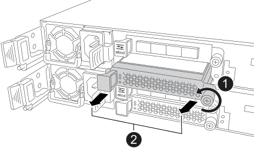

= 
:allow-uri-read: 

更換兩個控制器中的 I/O 模組或 I/O 模組擋板。

.關於這項工作
您從一個控制器開始，然後對另一個控制器重複這些步驟。

.步驟
. 如果您尚未接地、請正確接地。
. 在其中一個控制器上，從目標插槽移除 I/O 模組或 I/O 消隱模組。
+
下圖顯示正在移除 I/O 遮蔽模組。

+

+
[cols="1,4"]
|===

 a| 
image:../media/icon_round_1.png["圖說編號 1"]
 a| 
在 I/O 模組或 I/O 屏蔽模組上，逆時針旋轉指旋螺絲以將其鬆開。

 a| 
image:../media/icon_round_2.png["圖說編號 2"]
 a| 
使用左側的卡榫和蝶形螺絲將 I/O 模組或 I/O 屏蔽模組從控制器中拉出。

|===
. 安裝新的 I/O 模組：
+
.. 將 I/O 模組與控制器插槽開口的邊緣對齊。
.. 輕輕地將 I/O 模組完全推入插槽，確保模組正確插入連接器。
+
您可以使用左側的卡榫和指旋螺絲將 I/O 模組推入。

.. 順時針旋轉指旋螺絲以擰緊。

. 將 I/O 模組透過纜線連接至主機網路。
+
您可以使用系統安裝和設定內容的 link:../install-hw-ef50-ef80/install-cable.html["連接硬體"] 部分來進行主機網路佈線。

. 重複這些步驟，將 I/O 模組新增至另一個控制器。

