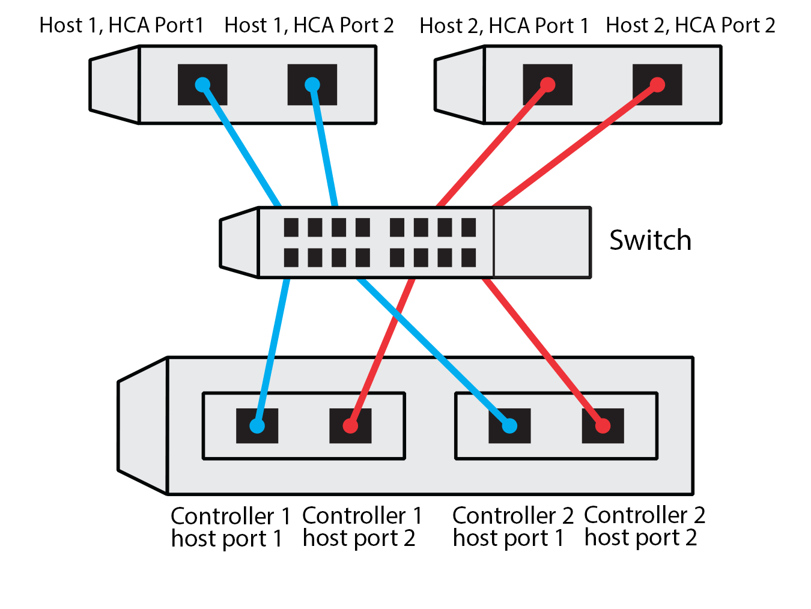

= 在 E 系列 - Linux 中記錄 NVMe over roce 組態
:allow-uri-read: 
:icons: font
:imagesdir: ../media/

[role="lead"]
您可以產生並列印本頁的PDF、然後使用下列工作表記錄NVMe over RoCE儲存組態資訊。您需要這些資訊來執行資源配置工作。

== 直接連線拓撲

在直接連線拓撲中、一或多部主機會直接連線至子系統。在支援從每個主機到子系統控制器的單一連線、如下所示。SANtricity在此組態中、每個主機的一個HCA（主機通道介面卡）連接埠應與所連接的E系列控制器連接埠位於同一子網路、但與其他HCA連接埠位於不同的子網路上。

image::../media/nvmeof_direct_connect.gif[NVMe over roce 直接連線範例]

滿足需求的範例組態包括四個子網路、如下所示：

* 子網路1：主機1 HCA連接埠1和控制器1主機連接埠1
* 子網路2：主機1 HCA連接埠2和控制器2主機連接埠1
* 子網路3：主機2 HCA連接埠1和控制器1主機連接埠2
* 子網路4：主機2 HCA連接埠2和控制器2主機連接埠2

== 交換器連線拓撲

在網路拓撲中、會使用一或多個交換器。請參閱 https://mysupport.netapp.com/matrix["NetApp 互通性對照表工具"^] 以取得支援的交換器清單。

== 主機識別碼

從每個主機找出並記錄啟動器NQN。

|===
| 主機連接埠連線 | 軟體啟動器NQN 

 a| 
主機（啟動器）1.
 a| 

 a| 
 a| 

 a| 
主機（啟動器）2.
 a| 

 a| 
 a| 

 a| 
 a| 

|===

== 目標NQN

記錄儲存陣列的目標NQN。

|===
| 陣列名稱 | 目標NQN 

 a| 
陣列控制器（目標）
 a| 

|===

== 目標NQN

記錄陣列連接埠要使用的NQN。

|===
| 陣列控制器（目標）連接埠連線 | NQN 

 a| 
控制器A、連接埠1
 a| 

 a| 
控制器B、連接埠1
 a| 

 a| 
控制器A、連接埠2
 a| 

 a| 
控制器B、連接埠2
 a| 

|===

== 對應主機名稱

NOTE: 對應主機名稱會在工作流程期間建立。

|===

 a| 
對應主機名稱
 a| 

 a| 
主機作業系統類型
 a| 

|===