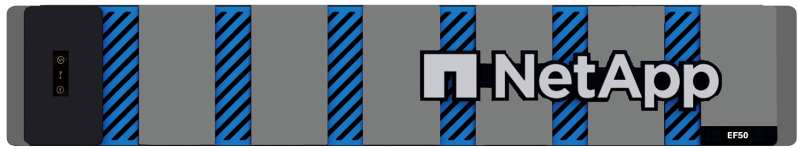
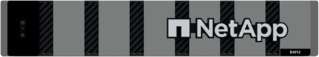
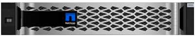

= 瞭解 E 系列硬體
:allow-uri-read: 
:icons: font
:imagesdir: ../media/

[role="lead"]
E系列儲存陣列有多種組態和機型可供選擇。

儲存陣列包括磁碟櫃、控制器、磁碟機、軟體和韌體。陣列可安裝在機架或機櫃中、並可在12、24或60個磁碟機的機櫃中、針對一或兩個控制器提供可自訂的硬體。您可以將儲存陣列從多種介面類型連接至SAN、並連接至各種主機作業系統。

下面列出了一些可用的 E 系列陣列型號。有關 E 系列陣列型號及其硬體規格的完整列表，請參閱 NetApp Hardware Universe，網址為 https://hwu.netapp.com["NetApp Hardware Universe"^]。

* EF50 系列 — 入門級全快閃記憶體、全 NVMe
* EF80 系列 -- 中階全快閃記憶體、全 NVMe
* E4000系列-入門級混合式
* EF600系列-中階All Flash、All NVMe
* EF300系列：入門級All Flash、All NVMe
* EF300C系列：入門級All Flash、All NVMe
* EF600C系列-中階All Flash、All NVMe
* E2800系列-入門級混合式
* EF280系列-入門級All Flash
* E5700系列-中階混合式
* EF570系列-中階All Flash

NOTE: 對於 SANtricity OS 11.80GA 或更高版本，SANtricity OS 運行時所有 USB 連接埠均停用。

[role="tabbed-block"]
====
.EF50 型號
--
機架尺寸::
+
--
* 2U24（2個機架單元；24個磁碟機）
+

--
磁碟機::
+
--
* 支援以下容量的 NVMe SSD 硬碟：
+
** 3.8 TB
** 7.6 TB
** 15.3 TB
** 30 TB
** 60 TB

* 控制器機架可支援高達 24 個 NVMe SSD 磁碟機。
* 每個控制器支援一或兩個主機介面卡。
* 支援用於雙控制器通訊的控制器間卡和纜線。
+

NOTE: 配置 EF50 系統時，正確連接鏡像纜線至關重要。如需詳細資訊，請參閱 https://docs.netapp.com/us-en/e-series/install-hw-ef50-ef80/install-cable.html#step-1-cable-the-inter-controller-mirroring-connections["連接控制器間鏡像連接線 - EF50 和 EF80"]。

--
介面::
+
--
可搭配下列介面使用：

* 64Gb NVMe / Fibre Channel
* 64Gb 光纖通道

--

--
.EF80 型號
--
機架尺寸::
+
--
* 2U24（2個機架單元；24個磁碟機）
+
image::../media/ef80_2u_front.png[EF80 2U]

--
磁碟機::
+
--
* 支援以下容量的 NVMe SSD 硬碟：
+
** 3.8 TB
** 7.6 TB
** 15.3 TB
** 30 TB
** 60 TB

* 控制器機架可支援高達 24 個 NVMe SSD 磁碟機。
* 每個控制器支援一、兩個或三個主機介面卡。
* 支援用於雙控制器通訊的控制器間卡和纜線。
+

NOTE: 配置 EF80 系統時，正確連接鏡像纜線至關重要。如需詳細資訊，請參閱 https://docs.netapp.com/us-en/e-series/install-hw-ef50-ef80/install-cable.html#step-1-cable-the-inter-controller-mirroring-connections["連接控制器間鏡像連接線 - EF50 和 EF80"]。

--
介面::
+
--
可搭配下列介面使用：

* 200GB NVMe / RoCE
* 64Gb NVMe / Fibre Channel
* 200GB NVMe / IB
* 64Gb 光纖通道

--

--
.E4000機型
--
機架尺寸::
+
--
* 2U12（2個機架單元；12個磁碟機）
+

* 4U60（4個機架單元；60個磁碟機）
+
image::../media/e4000_4u_front.png[E4000 4U]

--
磁碟機::
+
--
支援下列磁碟機類型：

* 3.5吋NL-SAS（最多300個）
* 2.5吋SAS SSD（最多120個）

--
介面::
+
--
可搭配下列介面使用：

* 12GB SAS
* 1Gb 或 10Gb Base-T iSCSI
* 1GB ， 10Gb 或 25GB iSCSI
* 8GB ， 16GB 或 32GB FC

--

--
.EF600機型
--
機架尺寸::
+
--
2U24（2個機架單元；24個磁碟機）

--
磁碟機::
+
--
* NVMe SSD磁碟機：控制器機櫃最多24個NVMe SSD磁碟機。
* 含擴充櫃的NL-SAS磁碟機：DE212C與DE460C磁碟櫃的任何混合、不得超過420個NL-SAS磁碟機插槽與7個擴充磁碟櫃、除非僅使用DE212C磁碟櫃、否則允許8個DE212C磁碟櫃。例如、7個DE460C磁碟櫃或8個DE212C磁碟櫃、或5個DE460C磁碟櫃加上2個DE212磁碟櫃。
* 含擴充櫃的SAS SSD磁碟機：DE212C、DE224C和DE460C磁碟櫃的任何混合、除非僅使用DE212C磁碟櫃、否則不得超過96個SAS SSD磁碟機插槽和7個擴充磁碟櫃、否則允許使用8個DE212C磁碟櫃。例如、1個DE460C機櫃加上1個DE224C機櫃加上1個DE212C機櫃、或4個DE224C機櫃、或8個DE212C機櫃。
* 每個控制器支援兩個主機介面卡。
+
** 或者，每個控制器支援一個 200GB IB 主機介面卡。

* 支援選購的 SAS 擴充卡，可進行 SAS 擴充機櫃連線。
+
** SAS 擴充僅支援每個控制器具有一個主機介面卡的組態。

NOTE: 對於 SANtricity OS 11.80GA 及更高版本、 EF600 支援擴充機櫃組態、且基本托盤中沒有磁碟機使用此組態時、請先確定磁碟機已安裝在擴充機櫃內、並已正確連接至基礎機匣、然後再開啟系統電源。

--
介面::
+
--
可搭配下列介面使用：

* 25GB iSCSI
* 32GB NVMe /光纖通道
* 32GB SCSI /光纖通道
* 100GB iSER / IB
* 100GB SRP / IB
* 100GB NVMe / IB
* 100GB NVMe / RoCE
* 200GB iSER / IB
* 200GB NVMe / IB
* 200GB NVMe / RoCE

--

--
.EF600C機型
--
機架尺寸::
+
--
2U24（2個機架單元；24個磁碟機）

--
磁碟機::
+
--
* 支援 30TB 或 60TB 容量的 NVMe SSD 磁碟機。
+
** 僅相容於動態磁碟集區，不支援舊版 RAID 。

* NVMe SSD磁碟機：控制器機櫃最多24個NVMe SSD磁碟機。
* 每個控制器支援兩個主機介面卡。
+
** 或者，每個控制器支援一個 200GB IB 主機介面卡。
** 不支援擴充機櫃組態。

* 如果在系統開機期間沒有足夠的未指派磁碟機，則會自動建立單一磁碟池。

--
介面::
+
--
可搭配下列介面使用：

* 25GB iSCSI
* 32GB NVMe /光纖通道
* 32GB SCSI /光纖通道
* 100GB iSER / IB
* 100GB SRP / IB
* 100GB NVMe / IB
* 100GB NVMe / RoCE
* 200GB iSER / IB
* 200GB NVMe / IB
* 200GB NVMe / RoCE

--

--
.EF300機型
--
機架尺寸::
+
--
2U24（2個機架單元；24個磁碟機）

--
磁碟機::
+
--
* NVMe SSD磁碟機：控制器機櫃最多24個NVMe SSD磁碟機。
* 含擴充磁碟櫃的NL-SAS磁碟機：DE212C與DE460C磁碟櫃的任何混合、不得超過240個NL-SAS磁碟機插槽與4個擴充磁碟櫃、除非僅使用DE212C磁碟櫃、否則允許8個DE212C磁碟櫃。例如、4個DE460C磁碟櫃或8個DE212C磁碟櫃、或2個DE460C磁碟櫃加上2個DE212磁碟櫃。
* 含擴充櫃的SAS SSD磁碟機：DE212C、DE224C和DE460C磁碟櫃的任何混合、不得超過96個SAS SSD磁碟機插槽和4個擴充磁碟櫃、除非僅使用DE212C磁碟櫃、否則允許8個DE212C磁碟櫃。例如、1個DE460C機櫃加上1個DE224C機櫃加上1個DE212C機櫃、或4個DE224C機櫃、或8個DE212C機櫃。
* 支援選購的 SAS 擴充卡，可進行 SAS 擴充機櫃連線。
* 每個控制器支援一個主機介面卡。

NOTE: 對於 SANtricity OS 11.80GA 及更高版本、 EF300 支援擴充機櫃組態、且基本托盤中沒有磁碟機使用此組態時、請先確定磁碟機已安裝在擴充機櫃內、並已正確連接至基礎機匣、然後再開啟系統電源。

--
介面::
+
--
可搭配下列介面使用：

* 25GB iSCSI
* 32GB NVMe /光纖通道
* 32GB SCSI /光纖通道
* 100GB iSER / IB
* 100GB SRP / IB
* 100GB NVMe / IB
* 100GB NVMe / RoCE

--

--
.EF300C機型
--
機架尺寸::
+
--
2U24（2個機架單元；24個磁碟機）

--
磁碟機::
+
--
* 支援 30TB 或 60TB 容量的 NVMe SSD 磁碟機。
+
** 僅相容於動態磁碟集區，不支援舊版 RAID 。

* NVMe SSD磁碟機：控制器機櫃最多24個NVMe SSD磁碟機。
+
** 不支援擴充機櫃組態。

* 每個控制器支援一個主機介面卡。
* 如果在系統開機期間沒有足夠的未指派磁碟機，則會自動建立單一磁碟池。

--
介面::
+
--
可搭配下列介面使用：

* 25GB iSCSI
* 32GB NVMe /光纖通道
* 32GB SCSI /光纖通道
* 100GB iSER / IB
* 100GB SRP / IB
* 100GB NVMe / IB
* 100GB NVMe / RoCE

--

--
.E2800機型
--
機架尺寸::
+
--
* 2U12（2個機架單元；12個磁碟機）
* 2U24（2個機架單元；24個磁碟機）
+
image::../media/e2800_2u_front.gif[E2800 2U]

* 4U60（4個機架單元；60個磁碟機）
+
image::../media/e2860_front.gif[E2800 4U]

--
磁碟機::
+
--
支援下列磁碟機類型：

* 3.5吋NL-SAS（最多180個）
* 2.5吋SAS SSD（最多120個）
* 2.5吋SAS HDD（最多180個）

--
介面::
+
--
可搭配下列介面使用：

* 12GB SAS
* 10Gb或25GB iSCSI
* 16GB或32GB光纖通道

--

--
.EF280機型
--
機架尺寸::
+
--
2U24（2個機架單元；24個磁碟機）

--
磁碟機::
+
--
最多支援96個SSD 2.5吋磁碟機

--
介面::
+
--
可搭配下列介面使用：

* 12GB SAS
* 10Gb或25GB iSCSI
* 16GB或32GB光纖通道

--

--
.E5700機型
--
機架尺寸::
+
--
* 2U24（2個機架單元；24個磁碟機）
+
image::../media/e2800_2u_front.gif[E5700 2U]

* 4U60（4個機架單元；60個磁碟機）
+
image::../media/e2860_front.gif[E5700 4U]

--
磁碟機::
+
--
最多支援480種下列磁碟機類型：

* 3.5吋NL-SAS磁碟機
* 2.5吋SAS SSD磁碟機
* 2.5吋SAS HDD磁碟機

--
介面::
+
--
可搭配下列介面使用：

* 12GB SAS
* 10Gb或25GB iSCSI
* 16GB或32GB光纖通道
* 32GB NVMe /光纖通道
* 100GB iSER / IB
* 100GB SRP / IB
* 100GB NVMe / IB
* 100GB NVMe / RoCE

--

--
.EF570機型
--
機架尺寸::
+
--
2U24（2個機架單元；24個磁碟機）

--
磁碟機::
+
--
最多支援120個SSD 2.5吋磁碟機

--
介面::
+
--
可搭配下列介面使用：

* 12GB SAS
* 10Gb或25GB iSCSI
* 16GB或32GB光纖通道
* 32GB NVMe /光纖通道
* 100GB iSER / IB
* 100GB SRP / IB
* 100GB NVMe / IB
* 100GB NVMe / RoCE

--

--
====