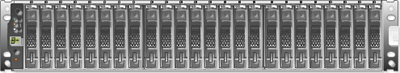

= E系列機櫃類型
:allow-uri-read: 
:icons: font
:imagesdir: ../media/

[role="lead"]
E系列系統提供多種機櫃尺寸。

|===
| 機櫃類型 | 圖示 

 a| 
* DE212C：*

* 2u12（2個機架單元；12個磁碟機）
* 3.5吋HDD和/或2.5吋SSD（含介面卡）
* 僅限E2800控制器

 a| 
image:../media/e2812_front.gif[""]

 a| 
* DE224C：*

* 2u24（2個機架單元；24個磁碟機）
* 2.5吋HDD和/或2.5吋SSD磁碟機
* E2800、EF280、E5700和EF570控制器

 a| 

 a| 
* DE460C:*

* 4u60（4個機架單元；60個磁碟機）
* 3.5吋和2.5吋磁碟機（NL-SAS、SAS和SSD）
* E2800與E5700控制器

 a| 
image:../media/de460c.gif[""]

 a| 
* NE224:*

* 2u24（2個機架單元；24個磁碟機）
* 2.5吋NVMe SSD磁碟機
* EF300和EF600控制器

 a| 
image:../media/ne224.gif[""]

|===