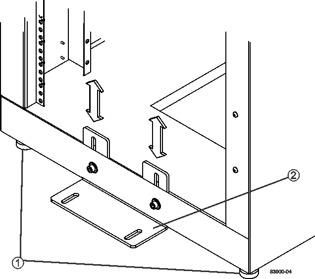

= 完整的機櫃安裝
:allow-uri-read: 
:icons: font
:imagesdir: ../media/

[role="lead"]
移動機櫃之後、請降低水平墊腳和穩定墊腳、重新安裝您所移除的元件、安裝其他必要元件、然後將機櫃連接至電源。

== 步驟1：降低水平墊腳和穩定墊腳

您可以調整機櫃的腳部來穩定機櫃。水平墊支腳可將機櫃從腳輪上脫落。穩定支腳可防止機櫃放置在固定位置後掉落。

.步驟
. 降低水平墊腳、將機櫃從腳輪上支撐。
+
水平墊腳位於機櫃的每個底部角落附近。

. 確保機櫃儘可能水平。
+
下圖提供穩定支腳和水平墊腳的近距離檢視。

+

+
|===

 a| 
1.
 a| 
調整足部水平

 a| 
2.
 a| 
穩定足部

|===

== 步驟2：重新安裝紙匣

移動機櫃之後、您可以將紙匣重新安裝到原來的位置。

CAUTION: _do not _將下列紙匣安裝在機箱頂端的頭上。當這些紙匣裝滿時、每個紙匣的重量都超過100公斤（220磅）。如果安裝在機箱頂端、這些機箱就會形成一個非常沉重的機箱、容易變得不平衡：E2660、E2660、E2760、E5460、E5560、 和E5660控制器磁碟機匣、以及DE6600磁碟機匣

.步驟
. 將所有紙匣重新安裝在機櫃的原始位置。
+

CAUTION: *人身傷害風險*：空的紙匣重約56.7公斤（125磅）。需要三個人才能安全地搬移空的紙匣如果紙匣裝有元件、則需要機械式抬升裝置才能安全地移動紙匣

. 將所有元件重新安裝到紙匣的原始位置。
+
若要避免地址衝突和資料存取遺失、請更換同一個匣中的所有元件、並將其置於同一個匣中的相同位置

. 將所有纜線重新安裝到紙匣的原始位置。
. 將介面纜線佈線至機箱。
. 將主電源線從機櫃連接至兩個外部電源。_現在請勿插入電源線。

== 步驟3：安裝纜線軸和綁帶

重新安裝紙匣之後、請安裝纜線軸和綁帶。纜線捲軸和綁帶可容納控制器和磁碟匣的多餘纜線長度和纜線佈線。

.步驟
. 將纜線軸和綁帶安裝在垂直電源分配插座的兩側。
+
image::../media/83003_01_dwg_3040_cable_spools.gif[83003 01 dg3040纜線軸]

+
|===

 a| 
1.
 a| 
綁帶位置

 a| 
2.
 a| 
纜線捲軸

|===

== 步驟4：安裝其他紙匣

如有需要、您可以安裝其他紙匣。您必須涵蓋未使用的紙匣位置、以確保氣流正確。

.步驟
. 如果您有其他必須安裝的紙匣、請安裝這些紙匣的安裝硬體。
. 如果機櫃正面未完全裝滿紙匣、請使用前面板套件來覆蓋安裝紙匣上方或下方的空白空間。
+
必須覆蓋空的空間、才能維持機櫃中的正確通風。

. 開啟紙匣電源。

== 步驟5：安裝額外的安裝軌道

[role="lead"]
如果您要安裝控制器磁碟機匣或是另外出貨的磁碟機匣（機櫃中尚未安裝）、則可能需要在機櫃中安裝額外的安裝軌道。

.步驟
. 確定安裝滑軌的位置。
+
** *在現有的紙匣上方*-將安裝軌道放置在機箱的頂端紙匣上方。
** *在現有的紙匣下方*-將安裝軌道放置在有足夠空間容納所安裝的紙匣：
+
*** 適用於2U控制器磁碟機支架或磁碟機支架的8.9公分（3.5英吋）
*** 17.8公分（7英吋）、適用於4U控制器磁碟機匣或磁碟機匣

. 使用右前方和左前方垂直支架上的測量標記、將安裝軌道連接至機箱兩側的相同位置。
+
image::../media/92042_06.gif[920426.]

+
|===

 a| 
1.
 a| 
正面可調式軌道

 a| 
2.
 a| 
後可調式軌道

 a| 
3.
 a| 
調整板與螺絲

 a| 
4.
 a| 
軌道安裝M5 x 10公釐螺絲

 a| 
5.
 a| 
固定螺帽

 a| 
6.
 a| 
後壓緊托架

 a| 
7.
 a| 
垂直支撐

|===
+

NOTE: 當軌道安裝在3040機櫃中時、不會使用固定螺帽和後固定支架。

. 將後可調式軌道放在直立支撐上。
. 在後可調式軌道上、將可調式軌道孔對齊直立支撐孔前方的孔。
. 安裝兩個M5 x 10公釐螺絲。
+
.. 將螺絲穿過直立支撐軌道和後可調式軌道。
.. 鎖緊螺絲。

. 將正面可調式軌道放在直立支撐上。
. 在正面可調式軌道上、將可調式軌道孔對齊直立支撐孔前方的孔。
. 安裝兩個M5 x 10公釐螺絲。
+
.. 將一顆螺絲穿過垂直支撐軌道和前可調式軌道的底部孔。
.. 將一顆螺絲穿過垂直支撐軌道、以及正面可調式軌道上前三個孔的中間。
.. 鎖緊螺絲。

+

NOTE: 其餘兩個螺絲孔用於安裝紙匣

. 重複步驟3至步驟8、將第二個滑軌安裝在機箱另一側。
. 請依照適用的紙匣安裝指示安裝每個紙匣。
. 請選擇下列其中一個選項：
+
** 如果所有的紙匣位置都已滿、請開啟紙匣電源。
** 如果並非所有的紙匣位置都已滿、請使用前面板套件來覆蓋安裝紙匣上方或下方的空白區域。

== 步驟6：將機櫃連接至電源

若要完成機櫃安裝、請開啟機櫃元件的電源。

在紙匣執行開機程序時、紙匣正面和背面的LED會開始閃爍。視您的組態而定、可能需要幾分鐘才能完成開機程序。

.步驟
. 關閉機櫃中所有元件的電源。
. 將所有12個斷路器轉到關閉（向下）位置。
. 將六個NEMAL6-30連接器（美國和加拿大）或六個IEC 60309連接器（全球、美國和加拿大除外）的每個連接器、插入可用的電源插座。
+

NOTE: 您必須將每個PDU連接至機櫃外的獨立電源。

. 將所有12個斷路器轉到開啟（上）位置。
+
image::../media/83002_05_dwg_3040_cabinet_pdus.gif[83002 05圖3040機櫃PDU]

+
|===

 a| 
1.
 a| 
斷路器

 a| 
2.
 a| 
電源插座

 a| 
3.
 a| 
電源輸入框

|===
. 開啟機櫃中所有磁碟機匣的電源。
+

NOTE: 開啟磁碟機匣電源後、請等待30秒、然後再開啟控制器磁碟機匣的電源。

. 開啟磁碟機匣後、請等待30秒、然後開啟機櫃中所有控制器磁碟機匣的電源。

機櫃安裝完成。您可以恢復正常作業。
