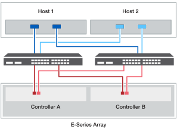

= 將主機連接至控制器或交換器的纜線（ E 系列）
:allow-uri-read: 
:icons: font
:imagesdir: ../media/

[role="lead"]
您可以將主機直接連接至控制器（直接附加拓撲）、或使用交換器（交換器拓撲）將主機連接至控制器。

== 直接附加拓撲的佈線

直接附加的拓撲會將主機介面卡直接連接至儲存系統中的控制器。

若要確保最高效能、請使用所有可用的主機介面卡連接埠。

.一個主機具有兩個 HBA
下圖顯示安裝了兩個 HBA 的一部主機範例。

image::../media/1host_2hbas_ieops-2145.svg[一台主機 / 兩個 HBA 和兩個控制器纜線]

.一台主機含兩個 HBA （替代纜線）
下圖顯示安裝了兩個 HBA 的一部主機範例。

image::../media/1host_2hbas_alternate_wkflw_ieops-2147.svg[一個主機 / 兩個 HBA 和兩個控制器纜線（替代纜線）]

.每個主機有兩個 HBA 的主機
下圖顯示兩部主機的範例，每部主機安裝兩個 HBA 。

image::../media/2hosts_4hbas_ieops-2146.svg[兩個主機 / 四個 HBA 和兩個控制器纜線]

== 交換器拓撲的佈線

交換器拓撲使用交換器將主機連接至儲存系統中的控制器。交換器必須支援主機與控制器之間使用的連線類型。

下圖顯示連線範例。對於提供資源配置功能的交換器、您應該隔離每個啟動器和目標配對。

.兩台主機和兩台交換器

*（1）*_將每個主機介面卡直接連接到交換器。_

*（2）*_將每個交換器直接連接至控制器上的主機連接埠。若要確保最高效能、請使用所有可用的主機介面卡連接埠。_
