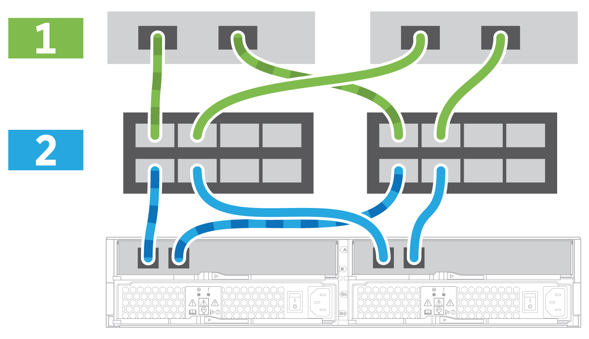

= 完整的儲存系統設定與組態： E5724 ， EF570 ， EF280 ， E2812 ， E2824 ， DE212C 和 DE224C
:allow-uri-read: 
:icons: font
:imagesdir: ../media/

[role="lead"]
瞭解如何將控制器連接至網路、並完成儲存系統的設定與組態設定。

== 步驟1：連接資料主機

根據您的網路拓撲佈線系統。

NOTE: 如果您使用的是AIX®、則必須先在主機上安裝E系列多重路徑驅動程式、然後再將其連線至陣列。

=== 選項1：直接附加拓撲

下列範例顯示使用直接附加拓撲連接至資料主機的纜線。

|===

 a| 
image:../media/2U_DirectTopology.png["直接附加拓撲纜線"]
 a| 
. 將每個主機介面卡直接連接到控制器上的主機連接埠。

|===

=== 選項2：網路拓撲

下列範例顯示使用光纖拓撲連接至資料主機的纜線。

|===

 a| 

 a| 
. 將每個主機介面卡直接連接到交換器。
. 將每個交換器直接連接至控制器上的主機連接埠。

|===

== 步驟2：連線並設定管理連線

您可以使用下列兩種選項之一來設定控制器管理連接埠：使用DHCP伺服器或使用靜態IP位址。

=== 選項1：DHCP伺服器

瞭解如何使用DHCP伺服器設定管理連接埠。

.開始之前
* 設定DHCP伺服器、將IP位址、子網路遮罩和閘道位址建立關聯、作為每個控制器的永久租用。
* 從網路管理員處取得用於連線至儲存系統的指派IP位址。

.步驟
. 將乙太網路纜線連接至每個控制器的管理連接埠、並將另一端連接至網路。
+
|===

 a| 
image:../media/cable_ethernet_inst-hw-e2800-e5700.png["乙太網路纜線"]
 a| 
乙太網路纜線（如有訂購）

|===
+
下圖顯示控制器管理連接埠位置的範例：

+
|===

 a| 
image:../media/e2800_mgmt_ports.png["E2800 管理連接埠"]

E2800控制器P1管理連接埠
 a| 
image:../media/e5700_mgmt_ports.png["E5700 管理連接埠"]

E5700控制器P1管理連接埠

|===
. 開啟瀏覽器、然後使用網路管理員提供給您的其中一個控制器IP位址連線至儲存系統。

=== 選項2：靜態IP位址

瞭解如何輸入IP位址和子網路遮罩、手動設定管理連接埠。

.開始之前
* 從網路管理員處取得控制器的IP位址、子網路遮罩、閘道位址、以及DNS和NTP伺服器資訊。
* 確定您使用的筆記型電腦未從DHCP伺服器接收網路組態。

.步驟
. 使用乙太網路纜線、將控制器A的管理連接埠連接至筆記型電腦的乙太網路連接埠。
+
|===

 a| 
image:../media/cable_ethernet_inst-hw-e2800-e5700.png["乙太網路纜線"]
 a| 
乙太網路纜線（如有訂購）

|===
+
下圖顯示控制器管理連接埠位置的範例：

+
|===

 a| 
image:../media/e2800_mgmt_ports.png["E2800 管理連接埠"]

E2800控制器P1管理連接埠
 a| 
image:../media/e5700_mgmt_ports.png["E5700 管理連接埠"]

E5700控制器P1管理連接埠

|===
. 開啟瀏覽器、然後使用預設IP位址（169.254.128.101）建立與控制器的連線。控制器會傳回自我簽署的憑證。瀏覽器會通知您連線不安全。
+

NOTE: 對於執行 SANtricity 11.60 以上版本的平台、預設子網路遮罩為 255.255.0.0 。

. 請依照瀏覽器的指示繼續進行、然後啟動SANtricity 《系統管理程式》。
+

NOTE: 如果無法建立連線、請確認您沒有從DHCP伺服器接收網路組態。

. 將儲存系統的密碼設定為登入。
. 使用網路管理員在*設定網路設定*精靈中提供的網路設定來設定控制器A的網路設定、然後選取*完成*。
+

NOTE: 因為您重設IP位址、System Manager會失去與控制器的連線。

. 從儲存系統中斷開筆記型電腦的連線、然後將控制器A上的管理連接埠連接至網路。
. 在連線至網路的電腦上開啟瀏覽器、然後輸入控制器A的新設定IP位址。
+

NOTE: 如果失去控制器A的連線、您可以將乙太網路纜線連接至控制器B、以便透過控制器B（169.254.128.102）重新建立與控制器A的連線。

. 使用您先前設定的密碼登入。
+
此時將顯示Configure Network Settings（配置網路設定）精靈。

. 使用網路管理員在*設定網路設定*精靈中提供的網路設定來設定控制器B的網路設定、然後選取*完成*。
. 將控制器B連接至網路。
. 在瀏覽器中輸入控制器B新設定的IP位址、以驗證控制器B的網路設定。
+

NOTE: 如果失去控制器B的連線、您可以使用先前驗證的控制器A連線、透過控制器A重新建立與控制器B的連線

== 步驟3：設定儲存系統

安裝硬體後、請使用SANtricity 「介紹」軟體來設定及管理儲存系統。

.開始之前
* 設定管理連接埠。
* 驗證並記錄您的密碼和IP位址。

.步驟
. 使用此軟件來配置和管理您的儲存陣列。SANtricity
. 在最簡單的網路組態中、將您的控制器連接至網頁瀏覽器、並使用SANtricity 「系統管理程式」來管理單一E2800或E5700系列儲存陣列。

|===

 a| 
image:../media/management_s_g2285tation_inst-hw-e2800-e5700_g2285.png["存取 System Manager 以設定管理連接埠"]
 a| 
若要存取System Manager、請使用您用來設定管理連接埠的相同IP位址。

|===