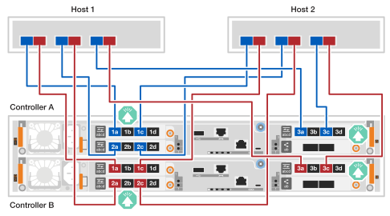
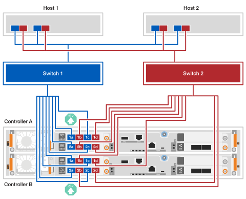

= 連接硬體線 - EF50 和 EF80
:allow-uri-read: 
:icons: font
:imagesdir: ../media/

[role="lead"]
安裝 EF50 或 EF80 儲存系統硬體後，請連接控制器間的鏡像連結和主機網路連線。（管理連接埠的連接將在「完整儲存系統設定」部分進行後續步驟。）

.關於這項工作
* 在本程序中，術語 _I/O 模組_ 指的是主機介面卡 (HIC)。
* 線纜圖示中帶有箭頭圖標，指示將連接器插入連接埠時線纜連接器拉片的正確方向（向上或向下）。
+
插入連接器時，應該可以感覺到它咔嗒一聲到位；如果沒有感覺到咔嗒聲，請將其取出，翻轉過來再試一次。

+
image:../media/drw_cable_pull_tab_direction_ieops-1699.svg["電纜拉片方向"]

== 步驟 1：連接控制器間鏡像連接線

將控制器彼此連接，以實現控制器間鏡像。控制器間鏡像連接可確保系統完全冗餘，並用於快取鏡像和 I/O 傳輸。EF50 和 EF80 儲存系統的佈線方式相同。

NOTE: 無論儲存系統中安裝的控制器間鏡像 I/O 模組的速度是 100 GbE 還是 200 GbE（取決於儲存系統的支援情況），您都應使用隨附的 200 GbE 線纜。如果控制器間鏡像 I/O 模組的速度為 100 GbE，則連線將以較低的速度（100 GbE）運作。

.步驟
. 將控制器連接在一起：
+
.. 將纜線 controller A port e4a 連接至 controller B port e4a。
.. 將纜線控制器 A 連接埠 e4b 連接至控制器 B 連接埠 e4b 。
+
*200 GbE 乙太網路線*

+
image::../media/oie_cable100_gbe_qsfp28.png[用於鏡像連接的 100 GbE 乙太網路線]

+
image:../media/drw_ef50-ef80_mirroring_2p_100gbe_ieops-2659.svg["ef50 和 ef80 控制器對控制器鏡像連接佈線"]

== 步驟 2：連接主機線纜

根據您的網路拓撲結構（直連或光纖連接）為儲存系統連接主機。

.關於這項工作
* 根據您的儲存系統型號，儲存系統中安裝的主機 I/O 模組類型可以是 Ethernet 或 Fibre Channel（FC）。本步驟中的佈線範例展示了儲存系統型號支援的這兩種主機 I/O 模組類型。
* 佈線範例未顯示主機 1 和主機 2 中的 4 連接埠 64Gb FC HBA；但是，如果您安裝了這些 HBA，則您可以按照 2 連接埠 HBA 所示的相同方式連接每隔一個連接埠。

[role="tabbed-block"]
====
.直接連接拓撲
--
以下範例展示如何使用直接連接拓撲將儲存系統連接到主機。

.EF50 配備兩個 4 連接埠 64Gb FC I/O 模組
[%collapsible]
=====
.關於這項工作
* 佈線範例顯示了插槽 1 和插槽 2 中的主機 I/O 模組。這是 EF50 儲存系統支援的最大主機 I/O 模組數量。但是,只需要插槽 1 中的主機 I/O 模組;插槽 2 中的主機 I/O 模組是可選的。
+
如果您的儲存系統安裝了一個主機 I/O 模組，您可以忽略連接到其他主機 I/O 模組的線纜，只需連接到已安裝的主機 I/O 模組即可。

* 直連儲存系統具有兩條獨立的冗餘路徑：路徑 A 和路徑 B。
+
** 路徑 A 的連接方式以藍色線材和主機及控制器上的藍色連接埠表示。它將每台主機上的 HBA 連接埠連接到控制器 A 連接埠 a 和 c。
** 路徑 B 的連接方式以紅色線纜和主機及控制器上的紅色連接埠表示。它將每台主機上的 HBA 連接埠連接到控制器 B 連接埠 a 和 c。

* 雖然佈線範例顯示 I/O 模組連接埠 a 和 c 連接到主機，但您可以使用連接埠 a 和 b 或連接埠 c 和 d。

.步驟
. 將主機連接到控制器：
+
.. 將主機 1 路徑 A （藍色） HBA 連接埠連接到控制器 A 的 a 連接埠 （1a 和 2a）。
.. 將主機 1 的 B 路徑（紅色）HBA 連接埠連接到控制器 B 的 a 連接埠（1a 和 2a）。
.. 將主機 2 路徑 A （藍色） HBA 連接埠連接到控制器 A 的 c 連接埠（1c 和 2c）。
.. 將主機 2 路徑 B （紅色） HBA 連接埠連接到控制器 B 的 c 連接埠 （1c 和 2c）。
+
*64 Gb/s FC 纜線*

+
image:../media/oie_cable_sfp_gbe_copper.png["64 Gb FC 線纜"]

+
image:../media/drw_ef50_4p_64gb_fc_2hic_direct_ieops-2670.svg["EF50 直連拓樸結構，使用兩個 4 連接埠 64GB FC I/O 模組連接到主機"]

=====
.EF80 配備三個 2 連接埠 200 GbE I/O 模組
[%collapsible]
=====
.關於這項工作
* 佈線範例顯示了位於插槽 1、2 和 3 的主機 I/O 模組。這是 EF80 儲存系統支援的最大主機 I/O 模組數量。但是，僅插槽 1 中的主機 I/O 模組是必要的；插槽 2 和插槽 3 中的主機 I/O 模組均為選購。
+
如果您的儲存系統安裝的主機 I/O 模組較少，您可以忽略連接到其他主機 I/O 模組的纜線，只需連接到已安裝的主機 I/O 模組即可。

* 直連儲存系統具有兩條獨立的冗餘路徑：路徑 A 和路徑 B。
+
** 路徑 A 的連接方式以藍色線材和主機及控制器上的藍色連接埠表示。它將每台主機上的 HBA 連接埠連接到控制器 A 連接埠 a 和 b。
** 路徑 B 的連接方式以紅色線纜和主機及控制器上的紅色連接埠表示。它將每台主機上的 HBA 連接埠連接到控制器 B 連接埠 a 和 b。

.步驟
. 將主機連接到控制器：
+
.. 將主機 1 路徑 A（藍色）HBA 連接埠連接至控制器 A 的 a 連接埠（e1a、e2a 和 e3a）。
.. 將主機 1 路徑 B（紅色）HBA 連接埠連接至控制器 B 的 a 連接埠（e1a、e2a 和 e3a）。
.. 將主機 2 路徑 A（藍色）HBA 連接埠連接至控制器 A 的 b 連接埠（e1b、e2b 和 e3b）。
.. 將主機 2 路徑 B（紅色）HBA 連接埠連接至控制器 B 的 b 連接埠（e1b、e2b 和 e3b）。
+
*200 GbE 電纜*

+
image::../media/oie_cable_sfp_gbe_copper.png[200 GbE 電纜]

+
image:../media/drw_ef80_2p_200gbe_ib_3hic_direct_ieops-2680.svg["EF80 直連拓樸結構使用三個 2 埠 200GbE IB I/O 模組連接到主機"]

=====
.EF80 配備三個 4 埠 64Gb FC I/O 模組
[%collapsible]
=====
.關於這項工作
* 佈線範例顯示了位於插槽 1、2 和 3 的主機 I/O 模組。這是 EF80 儲存系統支援的最大主機 I/O 模組數量。但是，僅插槽 1 中的主機 I/O 模組是必要的；插槽 2 和插槽 3 中的主機 I/O 模組均為選購。
+
如果您的儲存系統安裝的主機 I/O 模組較少，您可以忽略連接到其他主機 I/O 模組的纜線，只需連接到已安裝的主機 I/O 模組即可。

* 直連儲存系統具有兩條獨立的冗餘路徑：路徑 A 和路徑 B。
+
** 路徑 A 的連接方式以藍色線材和主機及控制器上的藍色連接埠表示。它將每台主機上的 HBA 連接埠連接到控制器 A 連接埠 a 和 c。
** 路徑 B 的連接方式以紅色線纜和主機及控制器上的紅色連接埠表示。它將每台主機上的 HBA 連接埠連接到控制器 B 連接埠 a 和 c。

* 雖然佈線範例顯示 I/O 模組連接埠 a 和 c 連接到主機，但您可以使用連接埠 a 和 b 或連接埠 c 和 d。

.步驟
. 將主機連接到控制器：
+
.. 將主機 1 路徑 A（藍色）HBA 連接埠連接至控制器 A 的 a 連接埠（1a、2a 和 3a）。
.. 將主機 1 的 B 路徑（紅色）HBA 連接埠連接到控制器 B 的 a 連接埠（1a、2a 和 3a）。
.. 將主機 2 路徑 A（藍色）HBA 連接埠連接至控制器 A 的 c 連接埠（1c、2c 和 3c）。
.. 將主機 2 路徑 B（紅色）HBA 連接埠連接至控制器 B 的 c 連接埠（1c、2c 和 3c）。
+
*64 Gb/s FC 纜線*

+
image:../media/oie_cable_sfp_gbe_copper.png["64 Gb FC 線纜"]

+

=====
--
.Fabric 附加拓撲
--
以下範例展示如何使用光纖連接拓撲將儲存系統連接到主機。

.EF50 配備兩個 4 連接埠 64Gb FC I/O 模組
[%collapsible]
=====
.關於這項工作
* 佈線範例顯示了插槽 1 和插槽 2 中的主機 I/O 模組。這是 EF50 儲存系統支援的最大主機 I/O 模組數量。但是,只需要插槽 1 中的主機 I/O 模組;插槽 2 中的主機 I/O 模組是可選的。
+
如果您的儲存系統安裝了一個主機 I/O 模組，您可以忽略連接到其他主機 I/O 模組的線纜，只需連接到已安裝的主機 I/O 模組即可。

* 光纖連接儲存系統具有兩個獨立的交換器路徑以實現備援：交換器 1 路徑和交換器 2 路徑。
+
** 交換器 1 路徑連線以藍色纜線和主機及控制器上的藍色連接埠顯示。它透過交換器 1 將每台主機上的 HBA 連接埠連接到控制器 A 和控制器 B 的 a 和 c 連接埠。
** 交換器 2 路徑連線以紅色纜線和主機及控制器上的紅色連接埠表示。它透過交換器 2 將每台主機上的 HBA 連接埠連接到控制器 A 和控制器 B 的 b 和 d 連接埠。

.步驟
. 將主機連接到交換器。
+
您可以使用交換器上的任何連接埠。

+
.. 將主機 1 和主機 2 的 HBA 連接埠透過交換器 1 路徑（藍色）連接到交換器 1。
.. 將主機 1 和主機 2 的纜線交換器 2 路徑 （紅色） HBA 連接埠連接到交換器 2。

. 將交換器連接至控制器：
+
.. 將纜線交換器 1（藍色）連接至控制器 A 的 a 和 c 連接埠（1a、2a、1c 和 2c）。
.. 將纜線交換器 1（藍色）連接至控制器 B 的 a 和 c 連接埠（1a、2a、1c 和 2c）。
.. 將纜線交換器 2（紅色）連接至控制器 A 的 b 和 d 連接埠（1b、2b、1d 和 2d）。
.. 將電纜開關 2（紅色）連接到控制器 B 的 b 和 d 連接埠（1b、2b、1d 和 2d）。
+
*64 Gb/s FC 纜線*

+
image:../media/oie_cable_sfp_gbe_copper.png["64 Gb FC 線纜"]

+

=====
.EF80 配備三個 2 連接埠 200 GbE I/O 模組
[%collapsible]
=====
.關於這項工作
* 佈線範例顯示了位於插槽 1、2 和 3 的主機 I/O 模組。這是 EF80 儲存系統支援的最大主機 I/O 模組數量。但是，僅插槽 1 中的主機 I/O 模組是必要的；插槽 2 和插槽 3 中的主機 I/O 模組均為選購。
+
如果您的儲存系統安裝的主機 I/O 模組較少，您可以忽略連接到其他主機 I/O 模組的纜線，只需連接到已安裝的主機 I/O 模組即可。

* 此佈線範例顯示每台主機上有三個 HBA。如果您的主機上的 HBA 少於三個，則可以忽略連接到額外 HBA 的佈線，只需連接到已安裝的 HBA 即可。
* 光纖連接儲存系統具有兩個獨立的交換器路徑以實現備援：交換器 1 路徑和交換器 2 路徑。
+
** 交換器 1 路徑連線以藍色纜線和主機及控制器上的藍色連接埠顯示。它透過交換器 1 將每台主機上的 HBA 連接埠連接到控制器 A 和控制器 B 的 a 連接埠。
** 交換器 2 路徑連線以紅色纜線和主機及控制器上的紅色連接埠表示。它透過交換器 2 將每台主機上的 HBA 連接埠連接到控制器 A 和控制器 B 的 b 連接埠。

.步驟
. 將主機連接到交換器：
+
您可以使用交換器上的任何連接埠。

+
.. 將主機 1 和主機 2 的 HBA 連接埠透過交換器 1 路徑（藍色）連接到交換器 1。
.. 將主機 1 和主機 2 的纜線交換器 2 路徑 （紅色） HBA 連接埠連接到交換器 2。

. 將交換器連接至控制器：
+
.. 將纜線交換器 1（藍色）連接至控制器 A 的 a 連接埠（e1a、e2a 和 e3a）。
.. 將纜線交換器 1（藍色）連接至控制器 B 的 a 連接埠（e1a、e2a 和 e3a）。
.. 將纜線交換器 2（紅色）連接至控制器 A 的 b 連接埠（e1b、e2b 和 e3b）。
.. 將纜線交換器 2（紅色）連接至控制器 B 的 b 連接埠（e1b、e2b 和 e3b）。
+
*200 GbE 電纜*

+
image::../media/oie_cable_sfp_gbe_copper.png[200 GbE 電纜]

+
image:../media/drw_ef80_2p_200gbe_ib_3hic_fabric_ieops-2679.svg["採用三個雙埠 200GbE I/O 模組的 EF80 光纖連接拓撲"]

=====
.EF80 配備三個 4 埠 64Gb FC I/O 模組
[%collapsible]
=====
.關於這項工作
* 佈線範例顯示了位於插槽 1、2 和 3 的主機 I/O 模組。這是 EF80 儲存系統支援的最大主機 I/O 模組數量。但是，僅插槽 1 中的主機 I/O 模組是必要的；插槽 2 和插槽 3 中的主機 I/O 模組均為選購。
+
如果您的儲存系統安裝的主機 I/O 模組較少，您可以忽略連接到其他主機 I/O 模組的纜線，只需連接到已安裝的主機 I/O 模組即可。

* 此佈線範例顯示每台主機上有三個 HBA。如果您的主機上的 HBA 少於三個，則可以忽略連接到額外 HBA 的佈線，只需連接到已安裝的 HBA 即可。
* 光纖連接儲存系統具有兩個獨立的交換器路徑以實現備援：交換器 1 路徑和交換器 2 路徑。
+
** 交換器 1 路徑連線以藍色纜線和主機及控制器上的藍色連接埠顯示。它透過交換器 1 將每台主機上的 HBA 連接埠連接到控制器 A 和控制器 B 的 a 和 c 連接埠。
** 交換器 2 路徑連線以紅色纜線和主機及控制器上的紅色連接埠表示。它透過交換器 2 將每台主機上的 HBA 連接埠連接到控制器 A 和控制器 B 的 b 和 d 連接埠。

.步驟
. 將主機連接到交換器：
+
您可以使用交換器上的任何連接埠。

+
.. 將主機 1 和主機 2 的 HBA 連接埠透過交換器 1 路徑（藍色）連接到交換器 1。
.. 將主機 1 和主機 2 的纜線交換器 2 路徑 （紅色） HBA 連接埠連接到交換器 2。

. 將交換器連接至控制器：
+
.. 將纜線交換器 1（藍色）連接至控制器 A 的 a 和 c 連接埠（1a、2a、3a、1c、2c 和 3c）。
.. 將纜線交換器 1（藍色）連接至控制器 B 的 a 和 c 連接埠（1a、2a、3a、1c、2c 和 3c）。
.. 將纜線交換器 2（紅色）連接至控制器 A 的 b 和 d 連接埠（1b、2b、3b、1d、2d 和 3d）。
.. 將纜線交換器 2（紅色）連接至控制器 B 的 b 和 d 連接埠（1b、2b、3b、1d、2d 和 3d）。
+
*64 Gb/s FC 纜線*

+
image:../media/oie_cable_sfp_gbe_copper.png["64 Gb FC 線纜"]

+
image:../media/drw_ef80_4p_64gb_fc_3hic_fabric_ieops-2675.svg["採用三個 4 連接埠 64GB FC I/O 模組的 EF80 光纖連接拓撲"]

=====
--
====
.接下來呢？
在為儲存系統完成控制器間鏡像和主機連接的佈線後，link:install-power-hardware.html["啟動儲存系統"]。
