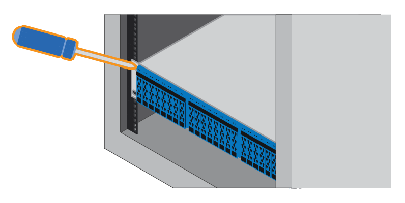

= 安裝硬體
:allow-uri-read: 
:icons: font
:imagesdir: ../media/

[role="lead"]
您可以在雙柱機架或NetApp系統機櫃中安裝EF300或EF600儲存系統。

.開始之前
在安裝EF300或EF600儲存系統之前、請務必執行下列動作：

* 請至以下網址註冊硬體： http://mysupport.netapp.com/["mysupport.netapp.com"^]。
* 準備一個無靜電的平坦工作區。
* 採取防靜態預防措施。

.步驟
. 打開硬體包裝。
+
.. 打開內容物的包裝、並將內含的硬體庫存在裝箱單上。
.. 繼續之前、請先閱讀所有指示。

. 安裝滑軌。
+

NOTE: 若要避免設備翻轉、請從機架或機櫃底部安裝硬體、直到頂端。

+
|===

 a| 
如果機架安裝硬體隨附說明、請參閱以瞭解如何安裝軌道。如需其他機架安裝指示、請參閱 link:../rackmount-hardware.html["機架安裝硬體"]。

 a| 
image:../media/install_rails_inst-hw-ef600.png[""]

|===
. 安裝機櫃。
+
|===

 a| 
.. 如果您要安裝多個機櫃、請從機櫃的底部到頂端開始安裝。將磁碟櫃的背面放在軌道上。
+

CAUTION: 安裝機櫃時、請與兩個人一起使用團隊合作。

.. 從底部支撐機櫃、將其滑入機櫃。

 a| 
image:../media/install_ef600.png[""]

|===
. 固定機櫃。
+
|===

 a| 
如需詳細資訊、請參閱 link:../rackmount-hardware.html["機架安裝硬體"]。

 a| 

|===
. 安裝面板。
+
|===

 a| 
.. 將面板對準磁碟櫃、然後卡入定位。

 a| 
image:../media/install_faceplate_2_0_inst-hw-ef600.png[""]

|===

