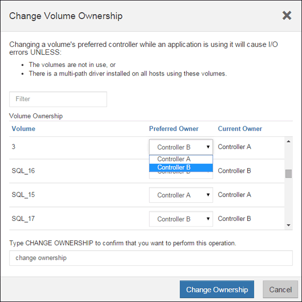

= 在E2800中新增第二個控制器機箱
:allow-uri-read: 
:experimental: 
:icons: font
:imagesdir: ../media/

[role="lead"]
您可以在E2800陣列中新增第二個控制器機箱。

.關於這項工作
本工作說明如何在單工版本的E2812控制器機櫃、E2824控制器機櫃或EF280快閃陣列中新增第二個控制器機箱。此程序也稱為單工對雙工轉換、這是線上程序。執行此程序時、您可以存取儲存陣列上的資料。

.開始之前
請確定您擁有下列項目：

* 新的控制器機箱、其零件編號與目前安裝的控制器機箱相同。（請參閱步驟1以確認零件編號。）
* 與目前安裝之控制器容器中的HIC相同的新HIC（僅當目前安裝的控制器容器包含主機介面卡時才需要）。
* 或採取其他防靜電預防措施。
* 1號十字螺絲起子。
* 用於識別新纜線的標籤。如需相容硬體的相關資訊、請參閱 https://mysupport.netapp.com/NOW/products/interoperability["NetApp 互通性對照表"^] 或 http://hwu.netapp.com/home.aspx["NetApp Hardware Universe"^]。
* 連接新控制器連接埠所需的所有纜線、收發器、交換器和主機匯流排介面卡（HBA）。
* 管理站、具備瀏覽器、可存取SANtricity 控制器的《系統管理程式》。（若要開啟System Manager介面、請將瀏覽器指向控制器的網域名稱或IP位址。）

== 步驟1：驗證新控制器的零件編號

確認新控制器的零件編號與目前安裝的控制器相同。

.步驟
. 打開新控制器容器的包裝、將其放置在無靜電的平面上。
. 找出控制器容器背面的MAC位址和FRU零件編號標籤。
+
image::../media/28_dwg_e2800_labels_maint-e2800.gif[28個dwge2800標籤維護e2800]

+
*（1）*_MAC位址：_管理連接埠1（「P1」）的MAC位址。如果您使用DHCP取得原始控制器的IP位址、則需要此位址才能連線至新的控制器。

+
*（2）*_FRU零件編號：_此編號必須符合目前安裝之控制器的更換零件編號。

. 從「系統管理程式」找到安裝的控制器容器的更換零件編號。SANtricity
+
.. 選取*硬體*。
.. 找到標有控制器圖示的控制器機櫃 image:../media/sam1130_ss_hardware_controller_icon_maint-e2800.gif[""]。
.. 按一下控制器圖示。
.. 選取控制器、然後按一下*「下一步*」。
.. 在「*基礎*」索引標籤上、記下控制器的*更換零件編號*。

. 確認已安裝控制器的更換零件編號與新控制器的FRU零件編號相同。
+

CAUTION: *可能會遺失資料存取*-如果兩個零件編號不同、請勿嘗試執行此程序。此外、如果原始控制器容器包含主機介面卡（HIC）、您必須在新的控制器容器中安裝相同的HIC。如果出現不相符的控制器或HIC、則當您將新控制器上線時、它將會鎖定。

== 步驟2：安裝主機介面卡

如果目前安裝的控制器包含HIC、您必須在第二個控制器容器中安裝相同型號的主機介面卡（HIC）。

.步驟
. 打開新的HIC、確認它與現有的HIC相同。
+

CAUTION: *可能會遺失資料存取*-安裝在兩個控制器容器中的HIC必須相同。如果更換的HIC與您要更換的HIC不同、請勿嘗試執行此程序。如果出現不相符的HIC、新控制器上線時就會鎖定。

. 翻轉新的控制器外殼、使其正面朝上。
. 按下機箱蓋上的按鈕、然後將機箱蓋滑出。
. 使用1號十字螺絲起子、卸下將空白面板連接至控制器外殼的四顆螺絲、然後卸下面板。
. 將HIC上的三個指旋螺絲對齊控制器上的對應孔、並將HIC底部的連接器對齊控制器卡上的HIC介面連接器。
+
請注意、請勿刮傷或撞擊HIC底部或控制器卡頂端的元件。

. 小心地將HIC降低到位、然後輕按HIC接頭以固定。
+

CAUTION: *可能的設備損壞*：請非常小心、不要夾住HIC和指旋螺絲之間控制器LED的金帶狀連接器。

+
image::../media/28_dwg_e2800_hic_thumbscrews_maint-e2800.gif[28 dwge2800 hic指旋螺絲維護e2800]

+
*（1）*主機介面卡_

+
*（2）*_指旋螺絲_

. 以手鎖緊HIC指旋螺絲。
+
請勿使用螺絲起子、否則可能會將螺絲鎖得太緊。

. 使用1號十字螺絲起子、將新的HIC面板裝到控制器容器上、並使用您先前卸下的四顆螺絲。
+
image::../media/28_dwg_e2800_hic_faceplace_screws_maint-e2800.gif[28圖e2800 hic faceplace螺絲mainstt e2800]

. 將控制器機箱蓋從後端滑到前端、直到按鈕發出卡響為止、以重新安裝控制器機箱上的機箱蓋。
. 將控制器箱放在一邊、直到準備好安裝為止。

== 步驟3：收集支援資料

在更換元件之前和之後收集支援資料、以確保您可以傳送一組完整的記錄給技術支援部門、以免更換無法解決問題。

.步驟
. 請從SANtricity 「無法使用的系統管理程式」首頁、確認儲存陣列的狀態為「最佳」。
+
如果狀態不是「最佳」、請使用Recovery Guru或聯絡技術支援部門來解決問題。請勿繼續執行此程序。

. 使用SANtricity NetApp System Manager收集儲存陣列的支援資料。
+
.. 選取功能表：Support（支援）[Support Center（支援中心）> Diagnostics（診斷）]。
.. 選擇*收集支援資料*。
.. 按一下「* Collect*」。
+
檔案會以* support-data.7z*的名稱儲存在瀏覽器的「下載」資料夾中。

. 確保儲存陣列與所有連線的主機之間不會發生I/O作業。例如、您可以執行下列步驟：
+
** 停止所有涉及從儲存設備對應至主機之LUN的程序。
** 確保沒有任何應用程式將資料寫入從儲存設備對應至主機的任何LUN。
** 卸載陣列上與磁碟區相關的所有檔案系統。
+

NOTE: 停止主機I/O作業的確切步驟取決於主機作業系統和組態、而這些步驟超出這些指示的範圍。如果您不確定如何停止環境中的主機I/O作業、請考慮關閉主機。

+

CAUTION: *可能的資料遺失*-如果您在執行I/O作業時繼續執行此程序、您可能會遺失資料。

== 步驟4：將組態變更為雙工

在將第二個控制器新增至控制器機櫃之前、您必須先安裝新的NVSRAM/檔案、然後使用命令列介面將儲存陣列設定為雙工、以將組態變更為雙工。NVSRAM/檔案的雙工版本隨附SANtricity 於適用於EOSR軟體（控制器韌體）的下載檔案中。

.步驟
. 從NetApp支援網站下載最新的NVSRAM,並將其下載至您的管理用戶端。
+
.. 從「支援系統管理程式」中選取功能表：「支援」[Upgrade Center]。SANtricity在標有SANtricity 「S16OS Software Upgrade」的區域、按一下「* NetApp SANtricity 作業系統Downloads *」。
.. 從NetApp支援網站選取* E系列SANtricity 《支援OS控制器軟體*》。
.. 依照線上指示選取您要安裝的NVSRAM版本、然後完成檔案下載。請務必選擇NVSRAM(檔案名稱結尾處有「D」)的雙工版本。
+
檔案名稱類似於：* N290X-830834-D01.DLP*

. 使用SANtricity 《Sytricity System Manager》升級檔案。
+

CAUTION: *資料遺失的風險或儲存陣列受損的風險*-升級期間請勿變更儲存陣列。維持儲存陣列的電力。

+
您可以在升級前的狀況檢查期間取消作業、但在傳輸或啟動期間無法取消。

+
** 從《系統管理程式》：SANtricity
+
... 在* SANtricity 《作業系統軟體升級*》下、按一下*「開始升級*」。
... 在* Select Controller NVSRAM/file*（選擇控制器NVSRAM*檔案）旁、按一下*瀏覽*、然後選取您下載的NVSRAM/檔案。
... 按一下* Start*（開始*）、然後確認您要執行此作業。
+
升級開始、並發生下列情況：

+
**** 升級前的健全狀況檢查隨即開始。如果升級前的狀況檢查失敗、請使用Recovery Guru或聯絡技術支援部門來解決問題。
**** 控制器檔案隨即傳輸並啟動。所需時間取決於您的儲存陣列組態。
**** 控制器會自動重新開機以套用新的設定。

** 或者、您也可以使用下列CLI命令來執行升級：
+
[listing]
----
download storageArray NVSRAM file="filename" healthCheckMelOverride=FALSE;
----
+
在此命令中、「檔案名稱」是控制器NVSRAM/檔案雙工版本的檔案路徑和檔案名稱（名稱為「D」的檔案）。將檔案路徑和檔案名稱括在雙引號（""）內。例如：

+
[listing]
----
file="C:\downloads\N290X-830834-D01.dlp"
----

. （可選）要查看已升級內容的列表，請單擊*保存日誌*。
+
檔案會儲存在瀏覽器的「下載」資料夾中、名稱為*最新升級記錄時間戳記*。

+
** 升級控制器的NVSRAM之後、請驗證SANtricity 下列資訊：
+
*** 移至「Hardware（硬體）」頁面、確認所有元件都已顯示。
*** 移至「軟體與韌體庫存」對話方塊（前往功能表：Support[升級中心]、然後按一下「*軟體與韌體庫存*」連結）。驗證新的軟體和韌體版本。

** 當您升級控制器的NVSRAM時、任何已套用至現有的NVSRAM的自訂設定都會在啟動程序期間遺失。啟動程序完成後、您必須再次將自訂設定套用至NVSRAM.

. 使用CLI命令將儲存陣列設定變更為雙工。若要使用CLI、您可以在下載CLI套件時開啟命令提示字元、如果已安裝Storage Manager、也可以開啟企業管理視窗（EMW）。
+
** 從命令提示字元：
+
... 使用下列命令將陣列從單工切換為雙工：
+
[listing]
----
set storageArray redundancyMode=duplex;
----
... 使用下列命令重設控制器。
+
[listing]
----
reset controller [a];
----

** 從EMW介面：
+
... 選取儲存陣列。
... 選取功能表：工具[執行指令碼]。
... 在文字方塊中輸入下列命令。
+
[listing]
----
set storageArray redundancyMode=duplex;
----
... 選取功能表：「Tools（工具）」[「Verify and Execute（驗證與執行）
... 在文字方塊中輸入下列命令。
+
[listing]
----
reset controller [a];
----
... 選取功能表：「Tools（工具）」[「Verify and Execute（驗證與執行）

控制器重新開機後、會顯示「Alternate Controller missing」（缺少備用控制器）錯誤訊息。此訊息表示控制器A已成功轉換為雙工模式。此訊息會持續顯示、直到您安裝第二個控制器並連接主機纜線為止。

== 步驟5：移除控制器擋片

安裝第二個控制器之前、請先移除控制器擋片。控制器擋片安裝在只有一個控制器的控制器機櫃中。

.步驟
. 壓下控制器擋片的CAM握把上的栓鎖、直到其釋放為止、然後將CAM握把打開至右側。
. 將空白控制器外殼滑出機櫃、然後放在一旁。
+
當您移除控制器擋片時、會有一個折片移入到位、以封鎖閒置的機櫃。

== 步驟6：安裝第二個控制器容器

安裝第二個控制器機箱、將單工組態變更為雙工組態。

.步驟
. 翻轉控制器外殼、使可拆式護蓋面朝下。
. 將CAM握把放在開啟位置時、將控制器外殼完全滑入控制器機櫃。
+
image::../media/28_dwg_e2824_add_controller_canister.gif[28圖e2824新增控制器容器]

+
*（1）*_控制器容器_

+
*（2）*_CAM Handle_

. 將CAM握把往左移動、將控制器容器鎖定到位。
. 插入任何SFP+收發器、並將纜線連接至新的控制器。

== 步驟7：完成新增第二個控制器

完成新增第二個控制器的程序、方法是確認該控制器運作正常、重新安裝雙工NVSRAM檔、在控制器之間分散磁碟區、以及收集支援資料。

.步驟
. 控制器開機時、請檢查控制器LED和七段顯示。
+
重新建立與其他控制器的通訊時：

+
** 七區段顯示會顯示重複順序* OS*、* OL*、*空白_*、表示控制器離線。
** 黃色警示LED會持續亮起。
** 主機連結LED可能會亮起、閃爍或關閉、視主機介面而定。image:../media/28_dwg_attn_led_7s_display_maint-e2800.gif[""]
+
*（1）*_注意LED（黃色）_

+
*（2）*_se-seg段 顯示_

+
*（3）*_主機連結LED _

. 檢查控制器七段顯示器上的代碼是否已上線。如果顯示幕顯示下列其中一個重複順序、請立即移除控制器。
+
** * OE*、* L0*、*空白_*（不相符的控制器）
** * OE*、* L6*、*空白_*（不支援HIC）
+

CAUTION: *可能會遺失資料存取*-如果您剛安裝的控制器顯示其中一個代碼、而另一個控制器因任何原因而重設、則第二個控制器也可能會鎖定。

. 使用下列CLI命令、將陣列的設定從單工更新為雙工：
+
"et storageArray dancyMode=duplex；"

. 從「系統管理程式」確認控制器的狀態為「最佳」SANtricity 。
+
如果狀態不是最佳、或是有任何警示LED亮起、請確認所有纜線都已正確安裝、並檢查控制器機箱是否已正確安裝。如有必要、請移除並重新安裝控制器容器。

+

NOTE: 如果您無法解決問題、請聯絡技術支援部門。

. 使用SANtricity SKETSystem Manager重新安裝雙工版本的NVSRAM.
+
此步驟可確保兩個控制器的版本相同。

+

CAUTION: *資料遺失的風險或儲存陣列受損的風險*-升級期間請勿變更儲存陣列。維持儲存陣列的電力。

+

NOTE: 當您使用「支援系統管理程式」安裝新的NVSRAM/R檔案時、您必須安裝SANtricity 此作業系統軟體SANtricity 。如果您已經擁有SANtricity 最新版本的作業系統軟體、則必須重新安裝該版本。

+
.. 如有必要、SANtricity 請從NetApp支援網站下載最新版的《支援》作業系統軟體。
.. 在System Manager中、前往升級中心。
.. 在* SANtricity 《作業系統軟體升級*》下、按一下*「開始升級*」。
.. 按一下*瀏覽*、然後選取SANtricity 「支援作業系統」軟體檔案。
.. 按一下*瀏覽*、然後選取控制器NVSRAM/檔案。
.. 按一下* Start*（開始*）、然後確認您要執行此作業。
+
控制權作業隨即開始傳輸。

. 控制器重新開機後、可選擇在控制器A和新控制器B之間分散磁碟區
+
.. 選取功能表：Storage[磁碟區]。
.. 從「All Volumes（所有磁碟區）」索引標籤中、選取功能表：More（更多）[Change Ownership
.. 在文字方塊中輸入下列命令：「Change所有權」
+
「變更擁有權」按鈕已啟用。

.. 對於您要重新分配的每個磁碟區、請從*偏好的擁有者*清單中選取*控制器B*。
+

.. 按一下*變更所有權*。
+
當程序完成時、「變更Volume Ownership」（變更Volume所有權）對話方塊會顯示*偏好的擁有者*和*目前擁有者*的新值。

. 使用SANtricity NetApp System Manager收集儲存陣列的支援資料。
+
.. 選取功能表：Support（支援）[Support Center（支援中心）> Diagnostics（診斷）]。
.. 按一下「* Collect*」。
+
檔案會以* support-data.7z*的名稱儲存在瀏覽器的「下載」資料夾中。

.接下來呢？
新增第二個控制器的程序已經完成。您可以恢復正常作業。
