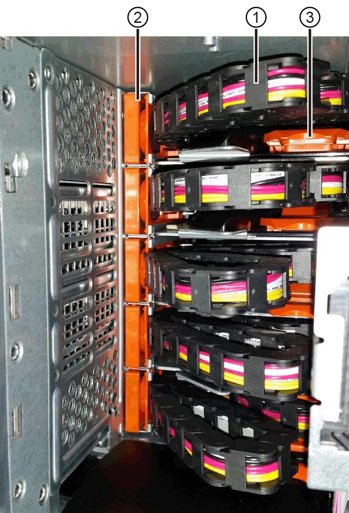

= 更換E2800（60個磁碟機櫃）中的磁碟機抽屜
:allow-uri-read: 
:experimental: 
:icons: font
:imagesdir: ../media/

[role="lead"]
您可以更換E2860控制器櫃或DE460C磁碟機櫃中的磁碟機匣。

更換E2860控制器機櫃或DE460C磁碟機櫃中故障磁碟櫃的步驟、取決於藥櫃中的磁碟區是否受到藥櫃損失保護。如果磁碟機藥櫃中的所有磁碟區都位於具有藥櫃遺失保護的磁碟集區或磁碟區群組中、您可以線上執行此程序。否則、您必須停止所有主機I/O活動、並在更換磁碟機匣之前關閉磁碟櫃電源。

.開始之前
* 檢閱中的磁碟機抽屜需求 link:drives-overview-supertask-concept.html["E2800磁碟機更換需求"]。
* 確定磁碟機櫃符合下列所有條件：
+
** 磁碟機櫃不能溫度過高。
** 兩個風扇都必須安裝、並處於最佳狀態。
** 所有磁碟機櫃元件都必須就位。
** 磁碟機匣中的磁碟區無法處於降級狀態。
+

CAUTION: *可能會遺失資料存取*-如果磁碟區已處於降級狀態、而您從磁碟機匣中移除磁碟機、則磁碟區可能會故障。

.您需要的是 #8217 ；需要的是什麼
* 更換磁碟機匣。
* 或您已採取其他防靜電預防措施。
* 一款手持燈。
* 當您從抽屜中取出磁碟機時、請記下每個磁碟機的確切位置的永久性標記。
* 存取儲存陣列的命令列介面（CLI）。如果您無法存取CLI、可以執行下列其中一項：
+
** * for SANtricity the 32 System Manager（11.60及更新版本）*-從System Manager下載CLI套件（壓縮檔）。移至功能表：設定[系統>附加元件>命令列介面]。然後您可以從作業系統提示字元發出CLI命令、例如DOS C：提示字元。
** *《SANtricity for the S廳Storage Manager/Enterprise Management Window（EMW）*》（《for the S廳 儲存管理程式/企業管理視窗（EMW）*）》）-請依照快速指南中的指示下載及安裝軟體。您可以從EMW中執行CLI命令、方法是選取功能表：「Tools（工具）」[「執行指令碼」]。

== 步驟1：準備更換磁碟機抽屜

確定您是否可以在磁碟機櫃上線時執行更換程序、或是需要停止主機I/O活動、並關閉任何已開啟電源的磁碟櫃。

如果您要用藥櫃遺失保護功能來更換藥櫃中的藥櫃、則無需停止主機I/O活動、也無需關閉任何磁碟櫃。

.步驟
. 確定磁碟機櫃是否已開啟電源。
+
** 如果電源關閉、則不需要發出CLI命令。前往  2: Remove cable chains。
** 如果電源已開啟、請執行下一步。

. 存取CLI、然後輸入下列命令：
+
[listing]
----
SMcli <ctlr_IP1\> -p "array_password" -c "set tray [trayID] drawer [drawerID]
serviceAllowedIndicator=on;"
----
+
其中：

+
** 「<ctlr_ip1>'是控制器的識別碼。
** 「array_password」是儲存陣列的密碼。您必須將「array_password」的值括在雙引號（""）內。
** 「TrayID]」是磁碟機櫃的識別碼、其中包含您要更換的磁碟機匣。磁碟機櫃ID值為0至99。您必須將「TrayID」的值括在方括弧中。
** 「drawerID」是您要更換的磁碟機匣的識別碼。藥櫃ID值為1（頂端藥櫃）至5（底部藥櫃）。必須將"drawerid"的值括在方括弧中。
+
此命令可確保您可以移除磁碟機櫃中最頂端的抽取盒10：

+
[listing]
----
SMcli <ctlr_IP1\> -p "safety-1" -c "set tray [10] drawer [1]
serviceAllowedIndicator=forceOnWarning;"
----
. 判斷您是否需要停止主機I/O活動、如下所示：
+
** 如果命令成功、您就不需要停止主機I/O活動。藥櫃中的所有磁碟機均位於「資源池」或「磁碟區群組」中、且具有藥櫃遺失保護功能。前往  2: Remove cable chains。
+

CAUTION: *可能損壞磁碟機*-在命令完成30秒後再開啟磁碟機匣。等待30秒可讓磁碟機減少磁碟機轉速、避免可能損壞硬體。

** 如果顯示警告、指出無法完成此命令、您必須先停止主機I/O活動、再移除藥櫃。顯示此警告是因為受影響的藥櫃中有一或多個磁碟機位於集區或磁碟區群組中、且無藥櫃遺失保護。若要避免遺失資料、您必須完成後續步驟、以停止主機I/O活動、並關閉磁碟機櫃和控制器機櫃的電源。

. 確保儲存陣列與所有連線的主機之間不會發生I/O作業。例如、您可以執行下列步驟：
+
** 停止所有涉及從儲存設備對應至主機之LUN的程序。
** 確保沒有任何應用程式將資料寫入從儲存設備對應至主機的任何LUN。
** 卸載陣列上與磁碟區相關的所有檔案系統。
+

NOTE: 停止主機I/O作業的確切步驟取決於主機作業系統和組態、而這些步驟超出這些指示的範圍。如果您不確定如何停止環境中的主機I/O作業、請考慮關閉主機。

. 如果儲存陣列參與鏡射關係、請停止次要儲存陣列上的所有主機I/O作業。
+

CAUTION: *可能的資料遺失*-如果您在執行I/O作業時繼續執行此程序、主機應用程式可能會因為無法存取儲存陣列而遺失資料。

. 等待快取記憶體中的任何資料寫入磁碟機。
+
當需要將快取資料寫入磁碟機時、每個控制器背面的綠色快取作用中LED會亮起。您必須等待此LED燈關閉。

+
image::../media/28_dwg_2800_controller_attn_led_maint-e2800.gif[28 dwg2800控制器收件人已引導維護e2800]

+
*（1）*_快取作用中LED _

. 從「SView System Manager」首頁SANtricity 、選取*「View Operations in progress*」（檢視進行中的作業*）。
. 請等待所有作業完成、然後再繼續下一步。
. 請使用下列其中一項程序關閉磁碟櫃電源：
+
** _如果您要將櫃中的抽屜*更換為*藥櫃損失保護_：不需要關閉任何磁碟櫃的電源。您可以在磁碟機匣上線時執行更換程序、因為已成功完成設定藥櫃服務動作允許指標CLI命令。
** _如果您要更換*控制器*機櫃*無*藥櫃損失保護_中的藥櫃：
+
... 關閉控制器機櫃上的兩個電源開關。
... 等待控制器機櫃上的所有LED都變暗。

** _如果您要更換*擴充*磁碟機櫃*無*藥櫃損失保護_中的藥櫃：
+
... 關閉控制器機櫃上的兩個電源開關。
... 等待控制器機櫃上的所有LED都變暗。
... 關閉磁碟機櫃上的兩個電源開關。
... 等待兩分鐘、讓磁碟機活動停止。

== 步驟2：移除纜線鏈

移除兩個纜線鏈、以便拆下並更換故障的磁碟機抽屜。

每個磁碟機抽屜都有左右纜線鏈。左右兩側的纜線鏈可讓抽屜滑入和滑出。

纜線鏈上的金屬端點會滑入機箱內相對應的垂直和水平導軌、如下所示：

* 左右垂直導軌可將纜線鏈連接至機箱的中板。
* 左右橫式導軌可將纜線鏈連接至個別的抽屜。

CAUTION: *可能的硬體損壞*-如果磁碟機匣已開啟電源、纜線鏈將會恢復運作、直到兩端都拔下為止。為避免設備發生短路、如果纜線鏈的另一端仍插上、請勿讓拔下的纜線鏈接頭接觸到金屬機箱。

.步驟
. 請確定磁碟機櫃和控制器櫃不再有I/O活動且已關機、或您已發出「設定藥櫃注意指標」CLI命令。
. 從磁碟機櫃的背面、移除右側的風扇容器：
+
.. 按下橘色彈片以釋放風扇容器握把。
+
圖中所示為從左側橘色標籤中展開及釋放的風扇容器握把。

+
image::../media/28_dwg_e2860_de460c_fan_canister_handle_with_callout_maint-e2800.gif[28圖e2860 de460c風扇容器握把、附有標註維護e2800]

+
*（1）*風扇容器握把_

.. 使用握把、將風扇箱從磁碟機匣中拉出、然後放在一旁。
.. 如果系統匣已開啟電源、請確定左風扇已達到最大速度。
+

CAUTION: *設備可能因過熱而受損*-如果系統匣已開機、請勿同時移除兩個風扇。否則、設備可能過熱。

. 確定要拔下的纜線鏈：
+
** 如果電源開啟、則抽屜正面的黃色警示LED會指出您需要拔下的纜線鏈。
** 如果電源關閉、您必須手動判斷要中斷連接的五條纜線鏈中的哪一條。圖中所示為磁碟機櫃右側、風扇箱已拆下。卸下風扇容器後、您可以看到每個抽屜的五個纜線鏈、以及垂直和水平連接器。
+
頂端纜線鏈連接至磁碟機抽屜1。底部的纜線鏈連接至磁碟機抽屜5。提供磁碟機匣1的標註。

+

+
*（1）*_纜線鏈_

+
*（2）*_垂直連接器（連接至中板）_

+
*（3）*_水平連接器（連接至藥櫃）_

. 為了方便存取、請用手指將右側的纜線鏈往左移動。
. 從相應的垂直導軌上拔下任何正確的纜線鏈。
+
.. 使用手電筒、找到連接至機箱中垂直導軌的纜線鏈末端橘色環。
+
image::../media/trafford_cable_rail_3_maint-e2800.gif[Trap纜線軌道3維護e2800]

+
垂直導軌上的*（1）*_橘色環_

+
*（2）*_纜線鏈、部分移除_

.. 若要解開纜線鏈、請將手指插入橘色環中、然後朝系統中央按下。
.. 若要拔下纜線鏈、請小心地將手指朝自己的方向拉約1英吋（2.5公分）。將纜線鏈連接器留在垂直導軌內。（如果磁碟機匣已開啟電源、請勿讓纜線鏈接頭接觸到金屬機箱。）

. 拔下纜線鏈的另一端：
+
.. 使用手電筒、在連接至機箱橫式導軌的纜線鏈末端找到橘色環。
+
圖中所示為右側的橫式連接器、而纜線鏈已中斷連接、並部分拉出左側。

+
image::../media/trafford_cable_rail_2_maint-e2800.gif[Trap纜線軌道2維護e2800]

+
*（1）*_橫式導軌上的橘環_

+
*（2）*_纜線鏈、部分移除_

.. 若要解開纜線鏈、請將手指輕插入橘色環、然後向下推。
+
圖中所示為橫式導軌上的橘色環（請參閱上圖中的項目1）、因為它會向下推、以便將其餘的纜線鏈從機箱中拉出。

.. 朝自己的方向拉動手指、拔下纜線鏈。

. 小心地將整個纜線鏈從磁碟機櫃中拉出。
. 更換右側風扇容器：
+
.. 將風扇容器完全滑入機櫃。
.. 移動風扇容器握把、直到其鎖住橘色彈片為止。
.. 如果磁碟機櫃正在接收電力、請確認風扇背面的黃色警示LED未亮起、且風扇背面有空氣排出。
+
重新安裝風扇後、LED可能會持續亮起一分鐘、同時兩個風扇都會穩定在正確的速度。

+
如果電源關閉、風扇將不會運轉、而且LED也不會亮起。

. 從磁碟機櫃的背面、移除左側的風扇容器。
. 如果磁碟機櫃正在接收電力、請確定適當的風扇達到最大速度。
+

CAUTION: *設備可能因過熱而受損*-如果磁碟櫃已開啟電源、請勿同時移除兩個風扇。否則、設備可能過熱。

. 從垂直導軌拔下左側纜線鏈：
+
.. 使用手電筒、找出連接至垂直導軌的纜線鏈末端的橘色環。
.. 若要解開纜線鏈、請將手指插入橘色環。
.. 若要拔下纜線鏈、請朝自己的方向拉約1英吋（2.5公分）。將纜線鏈連接器留在垂直導軌內。
+

CAUTION: *可能的硬體損壞*-如果磁碟機匣已開啟電源、纜線鏈將會恢復運作、直到兩端都拔下為止。為避免設備發生短路、如果纜線鏈的另一端仍插上、請勿讓拔下的纜線鏈接頭接觸到金屬機箱。

. 從橫式導軌拔下左纜線鏈、然後將整個纜線鏈從磁碟機櫃中拉出。
+
如果您是在電源開啟的情況下執行此程序、當您拔下最後一個纜線鏈連接器（包括黃色警示LED）時、所有LED都會關閉。

. 更換左風扇容器。如果磁碟機櫃正在接收電力、請確認風扇背面的黃色LED未亮起、且風扇背面有空氣排出。
+
重新安裝風扇後、LED可能會持續亮起一分鐘、同時兩個風扇都會穩定在正確的速度。

== 步驟3：移除故障的磁碟機匣

移除故障的磁碟機匣、以新的磁碟機匣進行更換。

CAUTION: *可能遺失資料存取*-磁區可能會破壞磁碟機上的所有資料、並對磁碟機電路造成無法修復的損害。為了避免資料遺失及磁碟機受損、請務必將磁碟機遠離磁性裝置。

.步驟
. 請確定：
+
** 右側和左側的纜線鏈已中斷連接。
** 更換左右風扇迴轉管。

. 從磁碟機櫃正面卸下擋板。
. 拉出兩個拉桿、以解開磁碟機抽屜。
. 使用延伸槓桿、小心地將磁碟機抽屜拉出、直到它停止為止。請勿將磁碟機匣從磁碟機櫃中完全移除。
. 如果已建立並指派磁碟區、請使用永久性標記來記錄每個磁碟機的確切位置。例如、使用下列圖示做為參考、在每個磁碟機的頂端寫下適當的插槽編號。
+
image::../media/dwg_trafford_drawer_with_hdds_callouts_maint-e2800.gif[具備HDD標註的Dwgt Trap抽屜維護e2800]

+

CAUTION: *可能會遺失資料存取權*-請務必在移除每個磁碟機之前、先記錄其確切位置。

. 從磁碟機匣中取出磁碟機：
+
.. 將每個磁碟機正面中央可見的橘色釋放栓扣、輕拉回。
.. 將磁碟機握把垂直提起。
.. 使用握把將磁碟機從磁碟機匣中提出。
+
image::../media/92_dwg_de6600_install_or_remove_drive_maint-e2800.gif[92 dwg de6600安裝或移除磁碟機維護e2800]

.. 將磁碟機放在無靜電的平面上、遠離磁性裝置。

. 移除磁碟機匣：
+
.. 找到磁碟機抽屜兩側的塑膠釋放拉桿。
+
image::../media/92_pht_de6600_drive_drawer_release_lever_maint-e2800.gif[92 PHT DE6600磁碟機抽屜釋放槓桿維護e2800]

+
*（1）*_磁碟機抽屜釋放槓桿_

.. 朝自己的方向拉動鎖條、以分離兩個釋放槓桿。
.. 同時按住兩個釋放拉桿、將磁碟機抽屜朝自己的方向拉動。
.. 從磁碟機櫃中取出磁碟機匣。

== 步驟4：安裝新的磁碟機抽屜

安裝新的磁碟機匣以更換故障的磁碟機匣。

.步驟
. 從磁碟機櫃的正面、將一顆閃燈放入空的抽屜插槽、然後找出該插槽的鎖定彈片。
+
鎖定的翻轉器組件是一項安全功能、可防止您一次開啟多個磁碟機抽屜。

+
image::../media/92_pht_de6600_lock_out_tumbler_detail_maint-e2800.gif[92 PHT de6600可鎖定翻轉器詳細資料維護e2800]

+
*（1）*_鎖定移轉器_

+
*（2）*_抽屜指南_

. 將更換的磁碟機抽取器放在空插槽前方、並稍微放在中央右側。
+
將抽屜稍微放在中央右側、有助於確保鎖定的翻轉器和抽屜導引器已正確接合。

. 將磁碟機抽屜滑入插槽、並確定抽屜導板滑入鎖定的轉筒下方。
+

CAUTION: *設備受損風險*-如果抽屜導板未滑入鎖定的翻轉器下方、就會造成損壞。

. 小心將磁碟機抽屜完全推入、直到鎖扣完全卡入為止。
+
第一次將藥櫃推至關閉位置時、遇到較高的阻力是正常現象。

+

CAUTION: *設備受損風險*：如果您覺得卡住、請停止推動磁碟機抽屜。使用抽屜正面的釋放拉桿、將抽屜滑出。然後、將抽屜重新插入插槽、確定玻璃杯位於軌道上方、且軌道正確對齊。

== 步驟5：連接纜線鏈

連接纜線鏈、以便安全地將磁碟機重新安裝到磁碟機匣中。

連接纜線鏈時、請依照您拔下纜線鏈時的順序進行。您必須先將鏈的橫式連接器插入機箱的橫式導軌、然後再將鏈的垂直連接器插入機箱的垂直導軌。

.步驟
. 請確定：
+
** 已安裝新的磁碟機抽屜。
** 您有兩個替換的纜線鏈、分別標示為左和右（位於磁碟機抽屜旁的橫式連接器上）。

. 從磁碟機櫃的背面、移除右側的風扇容器、然後將其放在一旁。
. 如果磁碟櫃已開啟電源、請確定左風扇達到最大速度。
+

CAUTION: *設備可能因過熱而受損*-如果磁碟櫃已開啟電源、請勿同時移除兩個風扇。否則、設備可能過熱。

. 連接正確的纜線鏈：
+
.. 找到右側纜線鏈上的水平和垂直連接器、以及機箱內部對應的水平導軌和垂直導軌。
.. 將兩個纜線鏈連接器對齊其對應的導軌。
.. 將纜線鏈的橫式連接器滑入橫式導軌、然後將其推入到底。
+

CAUTION: *設備故障風險*-請務必將連接器滑入導軌。如果連接器位於導軌頂端、則系統執行時可能會發生問題。

+
圖中顯示了機箱中第二個磁碟機抽屜的橫式和垂直導軌。

+
image::../media/2860_dwg_both_guide_rails_maint-e2800.gif[2860 dwx兩個導軌維護e2800]

+
*（1）*_橫式導軌_

+
*（2）*_垂直導軌_

.. 將右側纜線鏈上的垂直連接器滑入垂直導軌。
.. 重新連接纜線鏈的兩端之後、請小心拉動纜線鏈、以確認兩個連接器均已鎖定。
+

CAUTION: *設備故障風險*-如果連接器未鎖定、則纜線鏈可能會在抽屜運作期間鬆脫。

. 重新安裝適當的風扇容器。如果磁碟機櫃正在接收電力、請確認風扇背面的黃色LED燈現在已關閉、而且空氣現在從背面排出。
+
重新安裝風扇後、當風扇降至正確速度時、LED可能會持續亮起一分鐘。

. 從磁碟機櫃背面、移除磁碟櫃左側的風扇容器。
. 如果磁碟櫃已開啟電源、請確定適當的風扇達到最大速度。
+

CAUTION: *設備可能因過熱而受損*-如果磁碟櫃已開啟電源、請勿同時移除兩個風扇。否則、設備可能過熱。

. 重新連接左纜線鏈：
+
.. 找到纜線鏈上的橫式和垂直連接器、以及機箱內對應的橫式和直立式導軌。
.. 將兩個纜線鏈連接器對齊其對應的導軌。
.. 將纜線鏈的橫式連接器滑入橫式導軌、然後將其推入到底。
+

CAUTION: *設備故障風險*-請務必將連接器滑入導軌內。如果連接器位於導軌頂端、則系統執行時可能會發生問題。

.. 將左纜線鏈上的垂直連接器滑入垂直導軌。
.. 重新連接纜線鏈的兩端之後、請小心拉動纜線鏈、以確認兩個連接器均已鎖定。
+

CAUTION: *設備故障風險*-如果連接器未鎖定、則纜線鏈可能會在抽屜運作期間鬆脫。

. 重新安裝左風扇容器。如果磁碟機櫃正在接收電力、請確認風扇背面的黃色LED燈現在已關閉、而且空氣現在從背面排出。
+
重新安裝風扇後、LED可能會持續亮起一分鐘、同時兩個風扇都會穩定在正確的速度。

== 步驟6：完整更換磁碟機匣

重新插入磁碟機、並以正確順序裝回前擋板。

CAUTION: *可能會遺失資料存取*：您必須將每個磁碟機安裝在磁碟機抽屜的原始位置。

.步驟
. 請確定：
+
** 您知道每個磁碟機的安裝位置。
** 您已更換磁碟機抽屜。
** 您已安裝新的抽屜纜線。

. 在磁碟機匣中重新安裝磁碟機：
+
.. 拉出抽屜正面的兩個拉桿、以解開磁碟機抽屜。
.. 使用延伸槓桿、小心地將磁碟機抽屜拉出、直到它停止為止。請勿將磁碟機匣從磁碟機櫃中完全移除。
.. 使用您在卸下磁碟機時所做的備註、判斷每個插槽中要安裝的磁碟機。
+
image::../media/dwg_trafford_drawer_with_hdds_callouts_maint-e2800.gif[具備HDD標註的Dwgt Trap抽屜維護e2800]

.. 將磁碟機上的握把垂直提起。
.. 將磁碟機兩側的兩個凸起按鈕對齊抽屜的槽口。
+
圖中顯示了磁碟機的右側視圖、顯示了凸起按鈕的位置。

+
image::../media/28_dwg_e2860_de460c_drive_cru_maint-e2800.gif[28圖e2860 de460c磁碟機的CRU維護e2800]

+
磁碟機右側的*（1）*_凸起按鈕_

.. 將磁碟機垂直向下壓、確定磁碟機一直向下壓入磁碟機槽、然後向下旋轉磁碟機控制器、直到磁碟機卡入到位。
+
image::../media/92_dwg_de6600_install_or_remove_drive_maint-e2800.gif[92 dwg de6600安裝或移除磁碟機維護e2800]

.. 重複這些步驟以安裝所有磁碟機。

. 將抽屜從中央推回磁碟機櫃、然後關閉兩個槓桿。
+

CAUTION: *設備故障風險*-請務必同時推動兩個槓桿、以完全關閉磁碟機抽屜。您必須完全關閉磁碟機抽取器、以確保通風良好、並避免過熱。

. 將擋板連接至磁碟機櫃的正面。
. 如果您已關閉一或多個磁碟櫃、請使用下列其中一個程序重新啟動電源：
+
** _如果您更換*控制器*機櫃中的磁碟機匣、且沒有藥櫃遺失保護_：
+
... 開啟控制器機櫃上的兩個電源開關。
... 等待10分鐘、讓開機程序完成。確認兩個風扇均已開啟、且風扇背面的黃色LED燈已關閉。

** _如果您更換*擴充*磁碟機櫃中的磁碟機匣、但沒有抽屜損失保護_：
+
... 開啟磁碟機櫃上的兩個電源開關。
... 確認兩個風扇均已開啟、且風扇背面的黃色LED燈已關閉。
... 請先等待兩分鐘、再為控制器機櫃供電。
... 開啟控制器機櫃上的兩個電源開關。
... 等待10分鐘、讓開機程序完成。確認兩個風扇均已開啟、且風扇背面的黃色LED燈已關閉。

您的磁碟機匣更換已完成。您可以恢復正常作業。
