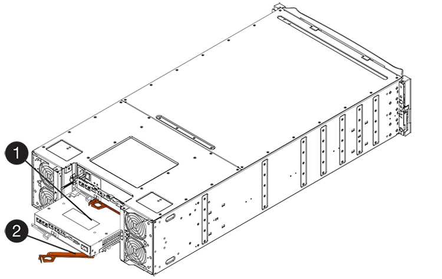

= 更換E2800主機介面卡（HIC）
:allow-uri-read: 
:experimental: 
:icons: font
:imagesdir: ../media/

[role="lead"]
您可以更換發生故障的主機介面卡（HIC）。

.關於這項工作
當您更換HIC時、請將控制器離線、移除控制器容器、安裝新的HIC、更換控制器箱、然後將控制器上線。

.開始之前
* 檢閱 link:hics-overview-supertask-concept.html["E2800 HIC更換要求"]。
* 您必須為此程序排程停機維護時間。安裝HIC時必須關閉電源、因此在成功完成此程序之前、您無法存取儲存陣列上的資料。（在雙工組態中、這是因為兩個控制器在開機時必須具有相同的HIC組態。）
* 請確定所有使用這些磁碟區的主機均未使用任何磁碟區、或已安裝多重路徑驅動程式。

.您需要的產品
* 一或兩個HIC、取決於您的儲存陣列中是否有一個或兩個控制器。HIC必須與您的控制器相容。如果有兩個控制器、則每個控制器必須具有相同的HIC。
* 用於識別連接至控制器容器的每條纜線的標籤。
* 或您已採取其他防靜電預防措施。
* 1號十字螺絲起子。
* 管理站、具備瀏覽器、可存取SANtricity 控制器的《系統管理程式》。（若要開啟System Manager介面、請將瀏覽器指向控制器的網域名稱或IP位址。）

== 步驟1：使控制器離線

控制器離線的步驟取決於您使用的是單一控制器（單工）或兩個控制器（雙工）。請參閱適當的指示：

* <<雙工：使控制器離線>>
* <<單工：關閉控制器機櫃的電源>>

=== 雙工：使控制器離線

如果您有雙工組態、請依照此步驟將控制器設為離線、以便安全地移除故障的HIC。

NOTE: 僅當您的儲存陣列有兩個控制器（雙工組態）時、才執行此工作。

.步驟
. 從Recovery Guru的「Details（詳細資料）」區域中、判斷哪些控制器容器有故障HIC。
. 使用SANtricity NetApp System Manager備份儲存陣列的組態資料庫。
+
如果在此程序期間發生問題、您可以使用儲存的檔案來還原組態。系統會儲存RAID組態資料庫的目前狀態、其中包含控制器上磁碟區群組和磁碟集區的所有資料。

+
** 從系統管理員：
+
... 選取功能表：Support（支援）[Support Center（支援中心）> Diagnostics（診斷）]。
... 選擇*收集組態資料*。
... 按一下「* Collect*」。
+
檔案會以*組態Data-<arrayName>-<DateTimer>.7z*的名稱儲存在瀏覽器的「下載」資料夾中。

** 或者、您也可以使用下列CLI命令來備份組態資料庫：
+
「ave storageArray dbmDatabase sourceLocation=Onboard contentID=all file="File"；」

. 使用SANtricity NetApp System Manager收集儲存陣列的支援資料。
+
如果在此程序期間發生問題、您可以使用儲存的檔案來疑難排解問題。系統會將儲存陣列的庫存、狀態和效能資料儲存在單一檔案中。

+
.. 選取功能表：Support（支援）[Support Center（支援中心）> Diagnostics（診斷）]。
.. 選擇*收集支援資料*。
.. 按一下「* Collect*」。
+
檔案會以* support-data.7z*的名稱儲存在瀏覽器的「下載」資料夾中。

. 如果控制器尚未離線、請使用SANtricity 「系統管理程式」將其離線。
+
** 從《系統管理程式》：SANtricity
+
... 選取*硬體*。
... 如果圖形顯示磁碟機、請選取*顯示磁碟櫃背面*以顯示控制器。
... 選取您要離線的控制器。
... 從內容功能表中選取*離線*、然後確認您要執行此作業。
+

NOTE: 如果您使用SANtricity 嘗試離線的控制器來存取「無法使用」功能、SANtricity 就會顯示「無法使用」訊息。選擇*連線至替代網路連線*、即可使用SANtricity 其他控制器自動存取《系統管理程式》。

** 或者、您也可以使用下列CLI命令將控制器離線：
+
*對於控制器A：*「設為控制器[a]可用度=離線」

+
*對於控制器B：*「設置控制器（b）可用度=離線」

. 等候SANtricity 「更新」功能將控制器狀態更新為「離線」。

CAUTION: 在更新狀態之前、請勿開始任何其他作業。

=== 單工：關閉控制器機櫃的電源

如果您使用單工組態、請關閉控制器機櫃的電源、以便安全地移除故障的HIC。

NOTE: 僅當您的儲存陣列有一個控制器（單工組態）時、才執行此工作。

.步驟
. 從「還原Guru」中檢閱詳細資料、確認HIC故障、並確保在移除和更換HIC之前、不需要處理其他項目。SANtricity
. 使用SANtricity NetApp System Manager備份儲存陣列的組態資料庫。
+
如果在此程序期間發生問題、您可以使用儲存的檔案來還原組態。系統會儲存RAID組態資料庫的目前狀態、其中包含控制器上磁碟區群組和磁碟集區的所有資料。

+
** 從系統管理員：
+
... 選取功能表：Support（支援）[Support Center（支援中心）> Diagnostics（診斷）]。
... 選擇*收集組態資料*。
... 按一下「* Collect*」。
+
檔案會以*組態Data-<arrayName>-<DateTimer>.7z*的名稱儲存在瀏覽器的「下載」資料夾中。

** 或者、您也可以使用下列CLI命令來備份組態資料庫：
+
「ave storageArray dbmDatabase sourceLocation=Onboard contentID=all file="File"；」

. 使用SANtricity NetApp System Manager收集儲存陣列的支援資料。
+
如果在此程序期間發生問題、您可以使用儲存的檔案來疑難排解問題。系統會將儲存陣列的庫存、狀態和效能資料儲存在單一檔案中。

+
.. 選取功能表：Support（支援）[Support Center（支援中心）> Diagnostics（診斷）]。
.. 選擇*收集支援資料*。
.. 按一下「* Collect*」。
+
檔案會以* support-data.7z*的名稱儲存在瀏覽器的「下載」資料夾中。

. 確保儲存陣列與所有連線的主機之間不會發生I/O作業。例如、您可以執行下列步驟：
+
** 停止所有涉及從儲存設備對應至主機之LUN的程序。
** 確保沒有任何應用程式將資料寫入從儲存設備對應至主機的任何LUN。
** 卸載陣列上與磁碟區相關的所有檔案系統。
+

NOTE: 停止主機I/O作業的確切步驟取決於主機作業系統和組態、而這些步驟超出這些指示的範圍。如果您不確定如何停止環境中的主機I/O作業、請考慮關閉主機。

+

CAUTION: *可能的資料遺失*-如果您在執行I/O作業時繼續執行此程序、您可能會遺失資料。

. 等待快取記憶體中的任何資料寫入磁碟機。
+
當需要將快取資料寫入磁碟機時、控制器背面的綠色快取作用中LED會亮起。您必須等待此LED燈關閉。

. 從「SView System Manager」首頁SANtricity 選取*「View Operations in progress*」。
. 請確認所有作業均已完成、然後再繼續下一步。
. 關閉控制器機櫃上的兩個電源開關。
. 等待控制器機櫃上的所有LED關閉。

== 步驟2：移除控制器容器

移除控制器容器、以便新增主機介面卡（HIC）。

.步驟
. 標示連接至控制器容器的每條纜線。
. 從控制器容器拔下所有纜線。
+

CAUTION: 為避免效能降低、請勿扭轉、摺疊、夾緊或踏上纜線。

. 確認控制器背面的快取作用中LED已關閉。
+
當需要將快取資料寫入磁碟機時、控制器背面的綠色快取作用中LED會亮起。您必須等到LED燈關閉後、才能移除控制器機箱。

+
image::../media/28_dwg_2800_controller_attn_led_maint-e2800.gif[28 dwg2800控制器收件人已引導維護e2800]

+
*（1）*_快取作用中LED _

. 擠壓CAM握把上的栓鎖、直到其釋放、然後向右打開CAM握把、將控制器容器從機櫃中釋放。
+
下圖為E2812控制器機櫃、E2824控制器機櫃或EF280快閃陣列的範例：

+
image::../media/28_dwg_e2824_remove_controller_canister_maint-e2800.gif[28圖e2824移除控制器機箱維護e2800]

+
*（1）*_控制器容器_

+
*（2）*_CAM Handle_

+
下圖是E2860控制器機櫃的範例：

+

+
*（1）*_控制器容器_

+
*（2）*_CAM Handle_

. 使用兩隻手和CAM把把、將控制器箱滑出機櫃。
+

CAUTION: 請務必用兩隻手支撐控制器容器的重量。

+
如果您要從E2812控制器機櫃、E2824控制器機櫃或EF280快閃陣列移除控制器機箱、則會有一個蓋板移到位以封鎖閒置的機櫃、有助於維持氣流和冷卻。

. 翻轉控制器外殼、使可拆式護蓋面朝上。
. 將控制器容器放在無靜電的平面上。

== 步驟3：安裝HIC

安裝HIC、以新的HIC取代故障的HIC。

CAUTION: *可能遺失資料存取*-如果HIC是針對另一個E系列控制器所設計、請勿在E2800控制器容器中安裝HIC。此外、如果您有雙工組態、則兩個控制器和兩個HIC都必須相同。如果出現不相容或不相符的HIC、則當您使用電源時、控制器會鎖定。

.步驟
. 打開新HIC和新HIC面板的包裝。
. 按下控制器外殼上的按鈕、然後將蓋板滑出。
. 確認控制器內部的綠色LED（透過DIMM）已關閉。
+
如果此綠色LED亮起、表示控制器仍在使用電池電力。您必須等到LED熄滅後、才能移除任何元件。

+
image::../media/28_dwg_e2800_internal_cache_active_led_maint-e2800.gif[28圖e2800內部快取作用中LED維護e2800]

+
*（1）*_內部快取作用中LED _

+
*（2）*_電池_

. 使用1號十字螺絲起子、卸下將空白面板連接至控制器外殼的四顆螺絲、然後卸下面板。
. 將HIC上的三個指旋螺絲對齊控制器上的對應孔、並將HIC底部的連接器對齊控制器卡上的HIC介面連接器。
+
請注意、請勿刮傷或撞擊HIC底部或控制器卡頂端的元件。

. 小心地將HIC降低到位、然後輕按HIC接頭以固定。
+

CAUTION: *可能的設備損壞*：請非常小心、不要夾住HIC和指旋螺絲之間控制器LED的金帶狀連接器。

+
image::../media/28_dwg_e2800_hic_thumbscrews_maint-e2800.gif[28 dwge2800 hic指旋螺絲維護e2800]

+
*（1）*主機介面卡_

+
*（2）*_指旋螺絲_

. 以手鎖緊HIC指旋螺絲。
+
請勿使用螺絲起子、否則可能會過度鎖緊螺絲。

. 使用1號十字螺絲起子、將新的HIC面板裝到控制器容器上、並使用您先前卸下的四顆螺絲。
+
image::../media/28_dwg_e2800_hic_faceplace_screws_maint-e2800.gif[28圖e2800 hic faceplace螺絲mainstt e2800]

== 步驟4：重新安裝控制器容器

安裝HIC之後、將控制器外殼重新安裝到控制器機櫃中。

.步驟
. 翻轉控制器外殼、使可拆式護蓋面朝下。
. 將CAM握把放在開啟位置時、將控制器外殼完全滑入控制器機櫃。
+
下圖為E2824控制器機櫃或EF280快閃陣列的範例：

+
image::../media/28_dwg_e2824_remove_controller_canister_maint-e2800.gif[28圖e2824移除控制器機箱維護e2800]

+
*（1）*_控制器容器_

+
*（2）*_CAM Handle_

+
下圖是E2860控制器機櫃的範例：

+

+
*（1）*_控制器容器_

+
*（2）*_CAM Handle_

. 將CAM握把往左移動、將控制器容器鎖定到位。
. 重新連接所有拔下的纜線。
+

NOTE: 此時請勿將資料纜線連接至新的HIC連接埠。

. （選用）如果您要將HIC新增至雙工組態、請重複所有步驟以移除第二個控制器機箱、安裝第二個HIC、然後重新安裝第二個控制器機箱。

== 步驟5：將控制器置於線上

控制器上線的步驟取決於您使用的是單一控制器（單工）或兩個控制器（雙工）。

=== 雙工：將控制器置於線上

對於雙工組態、請將控制器上線、收集支援資料、然後繼續作業。

NOTE: 僅當您的儲存陣列有兩個控制器時、才執行此工作。

.步驟
. 控制器開機時、請檢查控制器LED和七段顯示。
+

NOTE: 圖中顯示控制器容器範例。您的控制器可能有不同的編號和不同類型的主機連接埠。

+
重新建立與其他控制器的通訊時：

+
** 七區段顯示會顯示重複順序* OS*、* OL*、*空白_*、表示控制器離線。
** 黃色警示LED持續亮起。
** 主機連結LED可能會亮起、閃爍或關閉、視主機介面而定。image:../media/28_dwg_attn_led_7s_display_maint-e2800.gif[""]
+
*（1）*_注意LED（黃色）_

+
*（2）*_se-seg段 顯示_

+
*（3）*_主機連結LED _

. 使用SANtricity NetApp System Manager讓控制器上線。
+
** 從《系統管理程式》：SANtricity
+
... 選取*硬體*。
... 如果圖形顯示磁碟機、請選取*顯示磁碟櫃背面*。
... 選取您要放置在線上的控制器。
... 從內容功能表中選取*「線上放置」*、然後確認您要執行此作業。
+
系統會將控制器置於線上。

** 或者、您也可以使用下列CLI命令：
+
*對於控制器A：*「設為控制器[a]可用度=線上；」

+
*對於控制器B：*「設為控制器[b]可用度=線上；」

. 當控制器恢復連線時、請檢查控制器七段顯示器上的代碼。如果顯示幕顯示下列其中一個重複順序、請立即移除控制器。
+
** * OE*、* L0*、*空白_*（不相符的控制器）
** * OE*、* L6*、*空白_*（不支援HIC）
+

CAUTION: *可能會遺失資料存取*-如果您剛安裝的控制器顯示其中一個代碼、而另一個控制器因任何原因而重設、則第二個控制器也可能會鎖定。

. 當控制器重新連線時、請確認其狀態為最佳、並檢查控制器機櫃的注意LED。
+
如果狀態不是「最佳」、或是有任何警示LED亮起、請確認所有纜線均已正確安裝、並檢查HIC和控制器機箱是否已正確安裝。如有必要、請移除並重新安裝控制器容器和HIC。

+

NOTE: 如果您無法解決問題、請聯絡技術支援部門。

. 使用SANtricity NetApp System Manager收集儲存陣列的支援資料。
+
.. 選取功能表：Support（支援）[Support Center（支援中心）> Diagnostics（診斷）]。
.. 選擇*收集支援資料*。
.. 按一下「* Collect*」。
+
檔案會以* support-data.7z*的名稱儲存在瀏覽器的「下載」資料夾中。

. 如套件隨附的RMA指示所述、將故障零件退回NetApp。
+
請聯絡技術支援人員： http://mysupport.netapp.com["NetApp支援"^]如果您需要RMA號碼、請撥打888-463-8277（北美）、00-800-44-638277（歐洲）或+800-800-80-800（亞太地區）。

=== 單工：開啟控制器機櫃的電源

若為單工組態、請將電力套用至控制器機櫃、收集支援資料並恢復作業。

NOTE: 僅當您的儲存陣列有一個控制器時、才執行此工作。

.步驟
. 開啟控制器機櫃背面的兩個電源開關。
+
** 請勿在開機程序期間關閉電源開關、通常需要90秒或更短時間才能完成。
** 每個機櫃中的風扇在初次啟動時聲音非常大。開機期間的大聲雜訊是正常現象。

. 控制器開機時、請檢查控制器LED和七段顯示。
+
** 七區段顯示會顯示重複順序* OS*、* SD*、*空白_*、表示控制器正在執行「營業開始」（SOD）處理。控制器成功開機後、其七段顯示器應會顯示匣ID。
** 除非發生錯誤、否則控制器上的黃色警示LED會開啟然後關閉。
** 綠色主機連結LED會亮起。
+

NOTE: 圖中顯示控制器容器範例。您的控制器可能有不同的編號和不同類型的主機連接埠。

+
image::../media/28_dwg_attn_led_7s_display_maint-e2800.gif[28 dgn tled 7s顯示器維護e2800]

+
*（1）*_注意LED（黃色）_

+
*（2）*_se-seg段 顯示_

+
*（3）*_主機連結LED _

. 確認控制器的狀態為最佳、並檢查控制器機櫃的注意LED。
+
如果狀態不是「最佳」、或是有任何警示LED亮起、請確認所有纜線均已正確安裝、並檢查HIC和控制器機箱是否已正確安裝。如有必要、請移除並重新安裝控制器容器和HIC。

+

NOTE: 如果您無法解決問題、請聯絡技術支援部門。

. 使用SANtricity NetApp System Manager收集儲存陣列的支援資料。
+
.. 選取功能表：Support（支援）[Support Center（支援中心）> Diagnostics（診斷）]。
.. 選擇*收集支援資料*。
.. 按一下「* Collect*」。
+
檔案會以* support-data.7z*的名稱儲存在瀏覽器的「下載」資料夾中。

. 如套件隨附的RMA指示所述、將故障零件退回NetApp。
+
請聯絡技術支援人員： http://mysupport.netapp.com["NetApp支援"^]如果您需要RMA號碼、請撥打888-463-8277（北美）、00-800-44-638277（歐洲）或+800-800-80-800（亞太地區）。

.接下來呢？
您的HIC更換已完成。您可以恢復正常作業。
