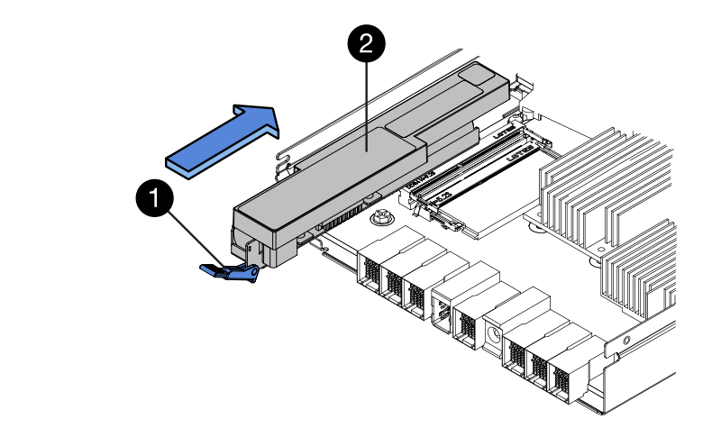

= 更換E5700電池
:allow-uri-read: 
:experimental: 
:icons: font
:imagesdir: ../media/

[role="lead"]
您可以在E5700儲存系統中更換故障的電池。

每個E5700控制器機箱都有一個電池、可在AC電源故障時保留快取的資料。如果「恢復大師」SANtricity 報告「電池故障」狀態或「需要更換電池」狀態、您必須更換受影響的電池。

.開始之前
* 確認所有使用這些磁碟區的主機上都未使用任何磁碟區、或安裝多重路徑驅動程式。
* 檢閱 link:batteries-intro-concept.html["E5700電池更換需求"]。

.您需要的是 #8217 ；需要的是什麼
* 替換電池。
* 或您已採取其他防靜電預防措施。
* 用於識別連接至控制器容器的每條纜線的標籤。
* 管理站、具備瀏覽器、可存取SANtricity 控制器的《系統管理程式》。（若要開啟System Manager介面、請將瀏覽器指向控制器的網域名稱或IP位址。）

== 步驟1：使控制器離線（雙工）

如果您有雙工組態、請將受影響的控制器離線、以便安全地取出故障電池。您未離線的控制器必須處於線上狀態（處於最佳狀態）。

NOTE: 僅當您的儲存陣列有兩個控制器（雙工組態）時、才執行此工作。

.步驟
. 從「還原系統管理程式」檢閱Recovery Guru中的詳細資料、確認電池有問題、並確保不需要先處理其他項目。SANtricity
. 從Recovery Guru的「Details（詳細資料）」區域中、判斷要更換的電池。
. 使用SANtricity NetApp System Manager備份儲存陣列的組態資料庫。
+
如果移除控制器時發生問題、您可以使用儲存的檔案來還原組態。系統會儲存RAID組態資料庫的目前狀態、其中包含控制器上磁碟區群組和磁碟集區的所有資料。

+
** 從《系統管理程式》：SANtricity
+
... 選取功能表：Support（支援）[Support Center（支援中心）> Diagnostics（診斷）]。
... 選擇*收集組態資料*。
... 按一下「* Collect*」。
+
檔案會以*組態Data-<arrayName>-<DateTimer>.7z*的名稱儲存在瀏覽器的「下載」資料夾中。

** 或者、您也可以使用下列CLI命令來備份組態資料庫：
+
「ave storageArray dbmDatabase sourceLocation=Onboard contentID=all file="File"；」

. 使用SANtricity NetApp System Manager收集儲存陣列的支援資料。
+
如果移除控制器時發生問題、您可以使用儲存的檔案來疑難排解問題。系統會將儲存陣列的庫存、狀態和效能資料儲存在單一檔案中。

+
.. 選取功能表：Support（支援）[Support Center（支援中心）> Diagnostics（診斷）]。
.. 選擇*收集支援資料*。
.. 按一下「* Collect*」。
+
檔案會以* support-data.7z*的名稱儲存在瀏覽器的「下載」資料夾中。

. 如果控制器尚未離線、請使用SANtricity 「系統管理程式」將其離線。
+
** 從《系統管理程式》：SANtricity
+
... 選取*硬體*。
... 如果圖形顯示磁碟機、請選取*顯示磁碟櫃背面*以顯示控制器。
... 選取您要離線的控制器。
... 從內容功能表中選取*離線*、然後確認您要執行此作業。
+

NOTE: 如果您使用SANtricity 嘗試離線的控制器來存取「無法使用」功能、SANtricity 就會顯示「無法使用」訊息。選擇*連線至替代網路連線*、即可使用SANtricity 其他控制器自動存取《系統管理程式》。

** 或者、您也可以使用下列CLI命令將控制器離線：
+
*對於控制器A：*「設為控制器[a]可用度=離線」

+
*對於控制器B：*「設置控制器（b）可用度=離線」

. 等候SANtricity 「更新」功能將控制器狀態更新為「離線」。
+

CAUTION: 在更新狀態之前、請勿開始任何其他作業。

== 步驟2：移除控制器容器

在取出故障電池之前、您必須先移除控制器容器。

.步驟
. 放置於防靜電腕帶上或採取其他防靜電預防措施。
. 標示連接至控制器容器的每條纜線。
. 從控制器容器拔下所有纜線。
+

CAUTION: 為避免效能降低、請勿扭轉、摺疊、夾緊或踏上纜線。

. 如果控制器容器上的主機連接埠使用SFP+收發器、請保留安裝狀態。
. 確認控制器背面的快取作用中LED已關閉。
. 擠壓CAM握把上的栓鎖、直到其釋放、然後向右打開CAM握把、將控制器容器從機櫃中釋放。
+
下圖是E5724控制器機櫃的範例：

+
image::../media/28_dwg_e2824_remove_controller_canister_maint-e5700.gif[28圖e2824移除控制器機箱維護e5700]

+
*（1）*_控制器容器_

+
*（2）*_CAM Handle_

+
下圖是E5760控制器機櫃的範例：

+
image::../media/28_dwg_e2860_add_controller_canister_maint-e5700.gif[28圖e2860新增控制器機箱維護e5700]

+
*（1）*_控制器容器_

+
*（2）*_CAM Handle_

. 使用兩隻手和CAM把把、將控制器箱滑出機櫃。
+

CAUTION: 請務必用兩隻手支撐控制器容器的重量。

+
如果您要從E5724控制器機櫃中取出控制器機箱、則會有一個蓋板會移到位以封鎖空的機櫃、有助於維持氣流和冷卻。

. 翻轉控制器外殼、使可拆式護蓋面朝上。
. 將控制器容器放在無靜電的平面上。

== 步驟3：取出故障電池

從控制器機櫃中取出控制器機箱之後、請取出電池。

.步驟
. 按下按鈕並將控制器外殼滑出、以取下控制器外殼。
. 確認控制器內部的綠色LED（電池與DIMM之間）已關閉。
+
如果此綠色LED亮起、表示控制器仍在使用電池電力。您必須等到LED熄滅後、才能移除任何元件。

+
image::../media/28_dwg_e2800_internal_cache_active_led_maint-e5700.gif[28圖e2800內部快取主動式維護e5700]

+
*（1）*_內部快取作用中LED _

+
*（2）*_電池_

. 找到電池的藍色釋放栓鎖。
. 向下推釋放栓鎖、將電池從控制器容器中取出。
+
image::../media/28_dwg_e2800_remove_battery_maint-e5700.gif[28圖e2800移除電池維護e5700]

+
*（1）*_電池釋放栓鎖_

+
*（2）*_電池_

. 提起電池、將其從控制器容器中滑出。
. 請依照您所在位置的適當程序來回收或棄置故障電池。
+

CAUTION: 為符合國際空運協會（IATA）規定、除非已安裝在控制器機櫃內、否則請勿以空運方式運送一顆電池。

== 步驟4：安裝新電池

取出故障電池後、請安裝新的電池。

.步驟
. 打開新電池的包裝、將其放在無靜電的平面上。
+

NOTE: 為符合IATA安全法規、更換電池的充電狀態（SoC）為30%以下。當您重新接上電源時、請記住、在更換電池充滿電且已完成初始記憶週期之前、寫入快取不會恢復。

. 調整控制器機箱的方向、使電池插槽朝向您。
. 以稍微向下的角度將電池插入控制器容器。
+
您必須將電池正面的金屬法蘭插入控制器外殼底部的插槽、然後將電池頂端滑入電池箱左側的小定位插銷下方。

. 向上移動電池栓鎖以固定電池。
+
當栓鎖卡入定位時、栓鎖底部會掛入機箱的金屬插槽。

+

+
*（1）*_電池釋放栓鎖_

+
*（2）*_電池_

. 翻轉控制器機箱、確認電池安裝正確。
+

CAUTION: *可能的硬體損壞*-電池正面的金屬法蘭必須完全插入控制器外殼上的插槽（如第一個圖所示）。如果電池安裝不正確（如第二個圖所示）、則金屬法蘭可能會接觸控制器板、在您接上電源時會對控制器造成損壞。

+
** *正確*：電池的金屬法蘭已完全插入控制器的插槽中：
+
image:../media/28_dwg_e2800_battery_flange_ok_maint-e5700.gif[""]

** *不正確*-電池的金屬法蘭未插入控制器的插槽：
+
image:../media/28_dwg_e2800_battery_flange_not_ok_maint-e5700.gif[""]

== 步驟5：重新安裝控制器容器

安裝新電池後、將控制器外殼重新裝入控制器機櫃。

.步驟
. 您可以將控制器外殼從後端滑到前端、直到按鈕發出卡響為止、以重新安裝控制器外殼。
. 翻轉控制器外殼、使可拆式護蓋面朝下。
. 將CAM握把放在開啟位置時、將控制器外殼完全滑入控制器機櫃。
+
image::../media/28_dwg_e2824_remove_controller_canister_maint-e5700.gif[28圖e2824移除控制器機箱維護e5700]

+
*（1）*_控制器容器_

+
*（2）*_CAM Handle_

+
image::../media/28_dwg_e2860_add_controller_canister_maint-e5700.gif[28圖e2860新增控制器機箱維護e5700]

+
*（1）*_控制器容器_

+
*（2）*_CAM Handle_

. 將CAM握把往左移動、將控制器容器鎖定到位。
. 重新連接所有纜線。

== 步驟6：將控制器置於線上（雙工）

若為雙工組態、請將控制器置於線上、收集支援資料並恢復作業。

NOTE: 僅當您的儲存陣列有兩個控制器時、才執行此工作。

.步驟
. 控制器開機時、請檢查控制器LED和七段顯示。
+

NOTE: 圖中顯示控制器容器範例。您的控制器可能有不同的編號和不同類型的主機連接埠。

+
重新建立與其他控制器的通訊時：

+
** 七區段顯示會顯示重複順序* OS*、* OL*、*空白_*、表示控制器離線。
** 黃色警示LED持續亮起。
** 主機連結LED可能會亮起、閃爍或關閉、視主機介面而定。image:../media/e5700_hic_3_callouts_maint-e5700.gif[""]
+
*（1）*_主機連結LED _

+
*（2）*注意LED（黃色）_

+
*（3）*_se-seg段 顯示_

. 使用SANtricity NetApp System Manager讓控制器上線。
+
** 從《系統管理程式》：SANtricity
+
... 選取*硬體*。
... 如果圖形顯示磁碟機、請選取*顯示磁碟櫃背面*。
... 選取您要放置在線上的控制器。
... 從內容功能表中選取*「線上放置」*、然後確認您要執行此作業。
+
系統會將控制器置於線上。

** 或者、您也可以使用下列CLI命令將控制器上線：
+
*對於控制器A：*「設為控制器[a]可用度=線上；」

+
*對於控制器B：*「設為控制器[b]可用度=線上；」

. 當控制器重新連線時、請確認其狀態為最佳、並檢查控制器機櫃的注意LED。
+
如果狀態不是「最佳」、或是有任何警示LED亮起、請確認所有纜線均已正確安裝、並檢查電池和控制器機箱是否已正確安裝。如有必要、請移除並重新安裝控制器容器和電池。

+

NOTE: 如果您無法解決問題、請聯絡技術支援部門。

. 如有需要、請使用SANtricity 《支援系統管理程式》為儲存陣列收集支援資料。
+
.. 選擇*支援*>*支援中心*>*診斷*。
.. 選擇*收集支援資料*。
.. 按一下「* Collect*」。
+
檔案會以* support-data.7z*的名稱儲存在瀏覽器的「下載」資料夾中。

電池更換完成。您可以恢復正常作業。
