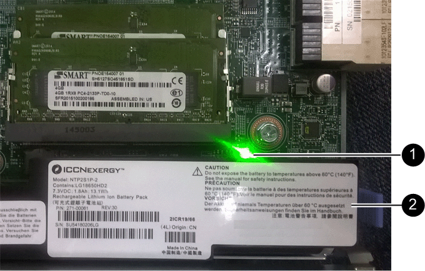

= 新增主機介面卡（ HIC ） - E5700
:allow-uri-read: 
:experimental: 
:icons: font
:imagesdir: ../media/

[role="lead"]
您可以使用基板主機連接埠、將主機介面卡（HIC）新增至E5700控制器容器。這項新增功能可增加儲存陣列中的主機連接埠數量、並提供額外的主機傳輸協定。

.關於這項工作
新增HIC時、您必須關閉儲存陣列電源、安裝HIC、然後重新接上電源。

.開始之前
* 檢閱 link:hics-overview-supertask-concept.html["E5700 HIC更換要求"]。
* 為此程序排定停機維護時間。安裝HIC時必須關閉電源、因此在成功完成此程序之前、您無法存取儲存陣列上的資料。（在雙工組態中、兩個控制器在開機時必須具有相同的HIC組態。）
* 請確定您擁有下列項目：
+
** 一或兩個HIC、取決於您的儲存陣列中是否有一個或兩個控制器。HIC必須與您的控制器相容。
** 為新的主機連接埠（例如交換器或主機匯流排介面卡（HBA））安裝新的主機硬體。
** 連接新主機連接埠所需的所有纜線、收發器、交換器和主機匯流排介面卡（HBA）。
+
如需相容硬體的相關資訊、請參閱 https://mysupport.netapp.com/NOW/products/interoperability["NetApp 互通性對照表"^] 和 http://hwu.netapp.com/home.aspx["NetApp Hardware Universe"^]。

** 用於識別連接至控制器容器的每條纜線的標籤。
** 或您已採取其他防靜電預防措施。
** 1號十字螺絲起子。
** 管理站、具備瀏覽器、可存取SANtricity 控制器的《系統管理程式》。（若要開啟System Manager介面、請將瀏覽器指向控制器的網域名稱或IP位址。）

== 步驟1：準備新增HIC

準備新增HIC、方法是備份儲存陣列的組態資料庫、收集支援資料、以及停止主機I/O作業。然後、您可以關閉控制器機櫃的電源。

.步驟
. 請從SANtricity 「無法使用的系統管理程式」首頁、確認儲存陣列的狀態為「最佳」。
+
如果狀態不是「最佳」、請使用Recovery Guru或聯絡技術支援部門來解決問題。請勿繼續執行此程序。

. 使用SANtricity NetApp System Manager備份儲存陣列的組態資料庫。
+
如果在此程序期間發生問題、您可以使用儲存的檔案來還原組態。系統會儲存RAID組態資料庫的目前狀態、其中包含控制器上磁碟區群組和磁碟集區的所有資料。

+
** 從系統管理員：
+
... 選取功能表：Support（支援）[Support Center（支援中心）> Diagnostics（診斷）]。
... 選擇*收集組態資料*。
... 按一下「* Collect*」。
+
檔案會以*組態Data-<arrayName>-<DateTimer>.7z*的名稱儲存在瀏覽器的「下載」資料夾中。

** 或者、您也可以使用下列CLI命令來備份組態資料庫：
+
「ave storageArray dbmDatabase sourceLocation=Onboard contentID=all file="File"；」

. 使用SANtricity NetApp System Manager收集儲存陣列的支援資料。
+
如果在此程序期間發生問題、您可以使用儲存的檔案來疑難排解問題。系統會將儲存陣列的庫存、狀態和效能資料儲存在單一檔案中。

+
.. 選取功能表：Support（支援）[Support Center（支援中心）> Diagnostics（診斷）]。
.. 選擇*收集支援資料*。
.. 按一下「* Collect*」。
+
檔案會以* support-data.7z*的名稱儲存在瀏覽器的「下載」資料夾中。

. 確保儲存陣列與所有連線的主機之間不會發生I/O作業。例如、您可以執行下列步驟：
+
** 停止所有涉及從儲存設備對應至主機之LUN的程序。
** 確保沒有任何應用程式將資料寫入從儲存設備對應至主機的任何LUN。
** 卸載陣列上與磁碟區相關的所有檔案系統。
+

NOTE: 停止主機I/O作業的確切步驟取決於主機作業系統和組態、而這些步驟超出這些指示的範圍。如果您不確定如何停止環境中的主機I/O作業、請考慮關閉主機。

+

CAUTION: *可能的資料遺失*-如果您在執行I/O作業時繼續執行此程序、主機應用程式可能會因為無法存取儲存設備而失去資料存取權。

. 如果儲存陣列參與鏡射關係、請停止次要儲存陣列上的所有主機I/O作業。
. 等待快取記憶體中的任何資料寫入磁碟機。
+
當需要將快取資料寫入磁碟機時、每個控制器背面的綠色快取作用中LED會亮起。您必須等待此LED燈關閉。

+
image::../media/e5700_ib_hic_w_cache_led_callouts_maint-e5700.gif[E5700 控制器上的快取作用中 LED]

+
*（1）*_快取作用中LED _

. 從「SView System Manager」首頁SANtricity 、選取*「View Operations in progress*」（檢視進行中的作業*）。請等待所有作業完成、然後再繼續下一步。
. 關閉控制器磁碟櫃的電源。
+
.. 關閉控制器機櫃上的兩個電源開關。
.. 等待控制器機櫃上的所有LED關閉。

== 步驟2：移除控制器容器

移除控制器容器、以便新增HIC。

.步驟
. 標示連接至控制器容器的每條纜線。
. 從控制器容器拔下所有纜線。
+

CAUTION: 為避免效能降低、請勿扭轉、摺疊、夾緊或踏上纜線。

. 確認控制器背面的快取作用中LED已關閉。
+
當需要將快取資料寫入磁碟機時、控制器背面的綠色快取作用中LED會亮起。您必須等到LED燈關閉後、才能移除控制器機箱。

+
image::../media/e5700_ib_hic_w_cache_led_callouts_maint-e5700.gif[E5700 控制器上的快取作用中 LED]

+
*（1）*_快取作用中LED _

. 擠壓CAM握把上的栓鎖、直到其釋放、然後向右打開CAM握把、將控制器容器從機櫃中釋放。
+
下圖是E5724控制器機櫃的範例：

+
image::../media/28_dwg_e2824_remove_controller_canister_maint-e5700.gif[拆下控制器容器]

+
*（1）*_控制器容器_

+
*（2）*_CAM Handle_

+
下圖是E5760控制器機櫃的範例：

+
image::../media/28_dwg_e2860_add_controller_canister_maint-e5700.gif[拆下控制器容器]

+
*（1）*_控制器容器_

+
*（2）*_CAM Handle_

. 使用兩隻手和CAM把把、將控制器箱滑出機櫃。
+

CAUTION: 請務必用兩隻手支撐控制器容器的重量。

+
如果您要從E5724控制器機櫃中取出控制器機箱、則會有一個蓋板會移到位以封鎖空的機櫃、有助於維持氣流和冷卻。

. 翻轉控制器外殼、使可拆式護蓋面朝上。
. 將控制器容器放在無靜電的平面上。

== 步驟3：安裝HIC

安裝主機介面卡（HIC）以增加儲存陣列中的主機連接埠數量。

CAUTION: *可能的資料存取遺失*-如果HIC是針對另一個E系列控制器所設計、請勿在E5700控制器機箱中安裝HIC。此外、如果您有雙工組態、則兩個控制器和兩個HIC都必須相同。如果出現不相容或不相符的HIC、則當您使用電源時、控制器會鎖定。

.步驟
. 打開新HIC和新HIC面板的包裝。
. 按下控制器外殼上的按鈕、然後將蓋板滑出。
. 確認控制器內部的綠色LED（透過DIMM）已關閉。
+
如果此綠色LED亮起、表示控制器仍在使用電池電力。您必須等到LED熄滅後、才能移除任何元件。

+

+
*（1）*_內部快取作用中_

+
*（2）*_電池_

. 使用1號十字螺絲起子、卸下將空白面板連接至控制器外殼的四顆螺絲、然後卸下面板。
. 將HIC上的三個指旋螺絲對齊控制器上的對應孔、並將HIC底部的連接器對齊控制器卡上的HIC介面連接器。
+
請注意、請勿刮傷或撞擊HIC底部或控制器卡頂端的元件。

. 小心地將HIC降低到位、然後輕按HIC接頭以固定。
+

CAUTION: *可能的設備損壞*：請非常小心、不要夾住HIC和指旋螺絲之間控制器LED的金帶狀連接器。

+
image::../media/28_dwg_e2800_hic_thumbscrews_maint-e5700.gif[將 HIC 安裝到控制器卡上]

+
*（1）*主機介面卡（HIC）_

+
*（2）*_指旋螺絲_

. 以手鎖緊HIC指旋螺絲。
+
請勿使用螺絲起子、否則可能會將螺絲鎖得太緊。

. 使用1號十字螺絲起子、將新的HIC面板裝到控制器容器上、並使用您先前卸下的四顆螺絲。
+
image::../media/28_dwg_e2800_hic_faceplace_screws_maint-e5700.gif[將 HIC 安裝到控制器上]

== 步驟4：重新安裝控制器容器

安裝新的HIC之後、將控制器外殼重新安裝到控制器機櫃中。

.步驟
. 翻轉控制器外殼、使可拆式護蓋面朝下。
. 將CAM握把放在開啟位置時、將控制器外殼完全滑入控制器機櫃。
+
下圖是E5724控制器機櫃的範例：

+
image::../media/28_dwg_e2824_remove_controller_canister_maint-e5700.gif[重新安裝控制器箱]

+
*（1）*_控制器容器_

+
*（2）*_CAM Handle_

+
下圖是E5760控制器機櫃的範例：

+
image::../media/28_dwg_e2860_add_controller_canister_maint-e5700.gif[重新安裝控制器箱]

+
*（1）*_控制器容器_

+
*（2）*_CAM Handle_

. 將CAM握把往左移動、將控制器容器鎖定到位。
. 重新連接所有拔下的纜線。
+

CAUTION: 此時請勿將資料纜線連接至新的HIC連接埠。

. （選用）如果您要將HIC新增至雙工組態、請重複所有步驟以移除第二個控制器機箱、安裝第二個HIC、然後重新安裝第二個控制器機箱。

== 步驟5：完成HIC新增

檢查控制器LED和七段顯示器、然後確認控制器的狀態為最佳。

.步驟
. 開啟控制器機櫃背面的兩個電源開關。
+
** 請勿在開機程序期間關閉電源開關、通常需要90秒或更短時間才能完成。
** 每個機櫃中的風扇在初次啟動時聲音非常大。開機期間的大聲雜訊是正常現象。

. 控制器開機時、請檢查控制器LED和七段顯示。
+
** 七區段顯示會顯示重複順序* OS*、* SD*、*空白_*、表示控制器正在執行「營業開始」（SOD）處理。控制器成功開機後、其七段顯示器應會顯示匣ID。
** 除非發生錯誤、否則控制器上的黃色警示LED會開啟然後關閉。
** 綠色的主機連結LED會持續亮起、直到您連接主機纜線為止。
+

NOTE: 圖中顯示控制器容器範例。您的控制器可能有不同的編號和不同類型的主機連接埠。

+
image::../media/e5700_hic_3_callouts_maint-e5700.gif[E5700 控制器 LED]

+
*（1）*_主機連結LED _

+
*（2）*注意LED（黃色）_

+
*（3）*_se-seg段 顯示_

. 從「系統管理程式」確認控制器的狀態為「最佳」SANtricity 。
+
如果狀態不是「最佳」、或是有任何警示LED亮起、請確認所有纜線均已正確安裝、並檢查HIC和控制器機箱是否已正確安裝。如有必要、請移除並重新安裝控制器容器和HIC。

+

NOTE: 如果您無法解決問題、請聯絡技術支援部門。

. 如果新的HIC連接埠需要SFP+收發器、請安裝這些SFP。
. 如果您安裝HIC搭配SFP+（光纖）連接埠、請確認新連接埠具有您所期望的主機傳輸協定。
+
.. 從「系統管理程式」中選取「*硬體*」SANtricity 。
.. 如果圖形顯示磁碟機、請按一下*顯示磁碟櫃背面*。
.. 選取控制器A或控制器B的圖形
.. 從內容功能表中選取*檢視設定*。
.. 選取*主機介面*索引標籤。
.. 按一下*顯示更多設定*。
.. 檢閱HIC連接埠的詳細資料（HIC位置*插槽1*中標示為* e0__x_*或* 0_x_*的連接埠）、以判斷您是否已準備好將主機連接埠連接至資料主機：
+
*** _如果新的HIC連接埠具有您所期望的傳輸協定_：
+
您已準備好將新的HIC連接埠連接至資料主機、請前往下一步。

*** _如果新的HIC連接埠*沒有*您期望的傳輸協定_：
+
您必須先套用軟體功能套件、才能將新的HIC連接埠連接至資料主機。請參閱 link:hpp-change-host-protocol-task.html["變更E5700主機傳輸協定"]。然後、將主機連接埠連接至資料主機並恢復作業。

. 將控制器主機連接埠的纜線連接至資料主機。
+
如果您需要設定及使用新主機傳輸協定的指示、請參閱 link:../config-linux/index.html["Linux Express組態"]、 link:../config-windows/index.html["Windows Express組態"]或 link:../config-vmware/index.html["VMware Express組態"]。

.接下來呢？
將主機介面卡新增至儲存陣列的程序已經完成。您可以恢復正常作業。
