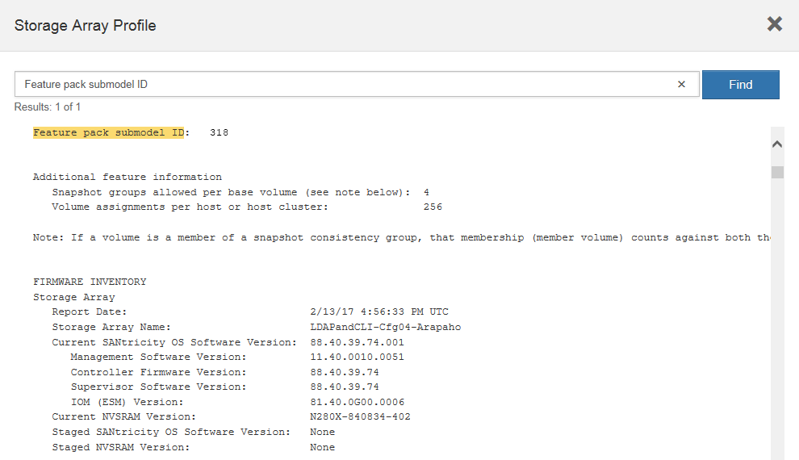

= 變更E5700主機傳輸協定
:allow-uri-read: 
:experimental: 
:icons: font
:imagesdir: ../media/

[role="lead"]
對於E5700儲存陣列、您可以依照下列方式轉換基板主機連接埠：

* 光纖通道（FC）至iSCSI
* iSCSI到FC
* 移轉至InfiniBand（IB）
* SRP至IB
* NVMe至IB
* NVMe至RoCE

== 步驟1：判斷您是否有雙傳輸協定SFP

使用「支援系統管理程式」來判斷您的SFP收發器類型。SANtricity由於這些SFP可搭配FC和iSCSI傳輸協定使用、因此稱為「雙傳輸協定」或「統一化」SFP。

如果目前的SFP支援16 Gbps和10 Gbps的資料傳輸率、您可以在轉換主機連接埠傳輸協定之後繼續使用這些資料傳輸率。

.步驟
. 從「支援系統管理員」中選取*「支援」*。SANtricity
. 選取*支援中心*方塊。
. 在Support Resources（支持資源）選項卡上，找到並選擇* Storage Array Profile*（*儲存陣列配置文件*）鏈接。
. 在文字方塊中輸入* SFP*、然後按一下*尋找*。
. 針對儲存陣列設定檔中列出的每個SFP、找出*支援的資料傳輸率*項目。
+
image::../media/sam1130_ss_e2800_unified_spf_maint-e5700.gif[Sam11330 s e2800統一化的SPF維護e5700]

. 請參閱下表以判斷您是否可以重複使用SFP、如下所示：
+
|===
| 支援的資料傳輸率 | SFP類型 | 支援的傳輸協定 

 a| 
16 Gbps、10 Gbps、4 Gbps
 a| 
雙傳輸協定
 a| 
** * FC：* 16 Gbps、4 Gbps
** iSCSI：約10 Gbps

 a| 
10 Gbps
 a| 
10 Gbps
 a| 
僅限iSCSI

 a| 
16 Gbps、8 Gbps、4 Gbps
 a| 
16 Gbps
 a| 
僅限FC

|===
+
** 如果您有雙傳輸協定SFP、則可在轉換傳輸協定之後繼續使用。
+

NOTE: 雙傳輸協定SFP不支援1 GB iSCSI。如果您要將主機連接埠轉換為iSCSI、請注意雙傳輸協定SFP僅支援連接埠的10 GB連結。

** 如果您有16個Gbps SFP、而且要將主機連接埠轉換成iSCSI、則必須移除SFP、並在轉換傳輸協定後、以雙傳輸協定或10 Gbps SFP加以取代。如有需要、您也可以搭配SFP使用特殊的雙AX纜線、使用10 Gbps iSCSI銅線。
+

NOTE: E28xx或E57xx控制器不支援8Gbps FC SFP。僅支援16Gbps和32 Gbps FC SFP。

** 如果您有10 Gbps SFP、而且要將主機連接埠轉換成FC、則必須從這些連接埠移除SFP、並在轉換傳輸協定之後、以雙傳輸協定或16 Gbps SFP加以取代。

== 步驟2：取得功能套件

若要取得功能套件、您需要控制器機櫃的序號、功能啟動代碼、以及儲存陣列的功能啟用識別碼。

.步驟
. 找出序號。
+
.. 從「支援系統管理程式」中選取功能表：「Support（支援中心）」SANtricity 。
.. 選取*支援資源*索引標籤後、捲動至*檢視頂端儲存陣列內容*區段。
.. 找到*機箱序號*、然後將此值複製到文字檔。
+
image::../media/sam1130_ss_e2800_storage_array_profile_sn_smid_copy_maint-e5700.gif[sam1130 s e2800儲存陣列設定檔sn SMID copy mainstt e5700]

. 找到*功能套件子模型ID*。
+
.. 從「支援系統管理員」SANtricity 中選取*「支援」*。
.. 選取*支援中心*方塊。
.. 在Support Resources（支持資源）選項卡上，找到並選擇* Storage Array Profile*（*儲存陣列配置文件*）鏈接。
.. 在文字方塊中輸入*功能套件子模型ID*、然後按一下*尋找*。
.. 找出用於初始組態的功能套件子模型ID。
+

. 使用功能套件子模型ID、找出開始組態的對應控制器子模型ID、並在下表中找到所需結束組態的功能啟動代碼。然後、將該功能啟動代碼複製到文字檔。
+

NOTE: 在HIC上執行NVMe傳輸協定時、基礎板連接埠會停用。

+

NOTE: 如果您不使用IB HIC、可以忽略下表中的「_HIC Ports_」欄：

+
|===
5+| 具備加密功能的功能啟動代碼（僅基礎板連接埠轉換） 

2+| 正在啟動組態 3+| 結束組態 

| 控制器子機型ID | 要轉換的連接埠 | 控制器子模型ID | 連接埠轉換為 | 功能啟動代碼 

 a| 
360
 a| 
FC基板連接埠
 a| 
363.62
 a| 
iSCSI基礎板連接埠
 a| 
SGL-2SL-ZEX13

 a| 
363.62
 a| 
iSCSI基礎板連接埠
 a| 
360
 a| 
FC基板連接埠
 a| 
5GA-44TB - ZW3HL

|===
+
|===
7+| 具備加密功能的功能啟動代碼 

3+| 正在啟動組態 4+| 結束組態 

| 控制器子模型ID | 基礎板連接埠 | HIC連接埠 | 控制器子模型ID | 基礎板連接埠 | HIC連接埠 | 功能啟動代碼 

 a| 
360
 a| 
FC
 a| 
商用
 a| 
361.
 a| 
FC
 a| 
SRP
 a| 
Uug-Xsb-ZCZKU

 a| 
363.62
 a| 
iSCSI
 a| 
商用
 a| 
SGL-2SL-ZEX13

 a| 
363
 a| 
iSCSI
 a| 
SRP
 a| 
VGN-LTB-ZGFCT

 a| 
383.82
 a| 
無法使用
 a| 
NVMe / IB
 a| 
KGA-ISB-ZDHQF

 a| 
403.
 a| 
無法使用
 a| 
NVMe / RoCE或NVMe / FC
 a| 
YGE-BHK-Z8EKB

 a| 
361.
 a| 
FC
 a| 
SRP
 a| 
360
 a| 
FC
 a| 
商用
 a| 
JGS-0TB-ZID1V

 a| 
363.62
 a| 
iSCSI
 a| 
商用
 a| 
UGX - RTB - ZLBPV

 a| 
363
 a| 
iSCSI
 a| 
SRP
 a| 
2G1-BTB-ZMRYN

 a| 
383.82
 a| 
無法使用
 a| 
NVMe / IB
 a| 
TGV：8TB-ZKT6

 a| 
403.
 a| 
無法使用
 a| 
NVMe / RoCE或NVMe / FC
 a| 
JGM-Eik-ZAC6Q

 a| 
363.62
 a| 
iSCSI
 a| 
商用
 a| 
360
 a| 
FC
 a| 
商用
 a| 
5GA-44TB - ZW3HL

 a| 
361.
 a| 
FC
 a| 
SRP
 a| 
EGL-NTB-ZKQ4

 a| 
363
 a| 
iSCSI
 a| 
SRP
 a| 
HGP-QUB - Z1IC

 a| 
383.383.3.
 a| 
無法使用
 a| 
NVMe / IB
 a| 
BGS-AUB-Z2YNG

 a| 
403.
 a| 
無法使用
 a| 
NVMe / RoCE或NVMe / FC
 a| 
1GW-Lik-ZG9HN

 a| 
363
 a| 
iSCSI
 a| 
SRP
 a| 
360
 a| 
FC
 a| 
商用
 a| 
SGU-Tub - Z3G2U

 a| 
361.
 a| 
FC
 a| 
SRP
 a| 
FGX -雙工- Z5WF7

 a| 
363.62
 a| 
iSCSI
 a| 
SRP
 a| 
LG3-GUB-Z7V17

 a| 
383.383.3.
 a| 
無法使用
 a| 
NVMe / IB
 a| 
NG5-ZUB-Z8C8J

 a| 
403.
 a| 
無法使用
 a| 
NVMe / RoCE或NVMe / FC
 a| 
WG2-0IK-ZI75U

 a| 
383.82
 a| 
無法使用
 a| 
NVMe / IB
 a| 
360
 a| 
FC
 a| 
商用
 a| 
QG6-ETB-ZPPPT

 a| 
361.
 a| 
FC
 a| 
SRP
 a| 
XG8-XTB-ZQ7XS

 a| 
363.62
 a| 
iSCSI
 a| 
商用
 a| 
SGB-HTB-ZS0AH

 a| 
363
 a| 
iSCSI
 a| 
SRP
 a| 
TGD-1T1D-ZTTTL

 a| 
403.
 a| 
無法使用
 a| 
NVMe / RoCE或NVMe / FC
 a| 
IGR-IIK-ZDBRB

 a| 
383.383.3.
 a| 
無法使用
 a| 
NVMe / IB
 a| 
360
 a| 
FC
 a| 
商用
 a| 
LG8-Jub - ZATLD

 a| 
361.
 a| 
FC
 a| 
SRP
 a| 
LGA-3UB-ZBAX1

 a| 
363.62
 a| 
iSCSI
 a| 
商用
 a| 
NGF-7UB-Z8KX

 a| 
363
 a| 
iSCSI
 a| 
SRP
 a| 
3GA-QUB：ZFP1年

 a| 
403.
 a| 
無法使用
 a| 
NVMe / RoCE或NVMe / FC
 a| 
5GA-Rik-ZL5PE

 a| 
403.
 a| 
無法使用
 a| 
NVMe / RoCE或NVMe / FC
 a| 
360
 a| 
FC
 a| 
商用
 a| 
BGC-UIK-Z03GR

 a| 
361.
 a| 
FC
 a| 
SRP
 a| 
LGF-Eik-ZPJX

 a| 
363.62
 a| 
iSCSI
 a| 
商用
 a| 
PGJ-HIK-ZSIDZ

 a| 
363
 a| 
iSCSI
 a| 
SRP
 a| 
1GM-1JK-ZTYQX

 a| 
383.82
 a| 
無法使用
 a| 
NVMe / IB
 a| 
JGN-XIK-ZQ142

|===
+
|===
5+| 非加密功能啟動代碼（僅基礎板連接埠轉換） 

2+| 正在啟動組態 3+| 結束組態 

| 控制器子機型ID | 要轉換的連接埠 | 控制器子模型ID | 連接埠轉換為 | 功能啟動代碼 

 a| 
365
 a| 
FC基板連接埠
 a| 
367.
 a| 
iSCSI基礎板連接埠
 a| 
BGU-GRB-ZM3KW

 a| 
367.
 a| 
iSCSI基礎板連接埠
 a| 
366,36
 a| 
FC基板連接埠
 a| 
9GU-2WB-Z503D

|===
+
|===
7+| 非加密功能啟動代碼 

3+| 正在啟動組態 4+| 結束組態 

| 控制器子機型ID | 基礎板連接埠 | HIC連接埠 | 控制器子機型ID | 基礎板連接埠 | HIC連接埠 | 功能啟動代碼 

 a| 
365
 a| 
FC
 a| 
商用
 a| 
366,36
 a| 
FC
 a| 
SRP
 a| 
BGA-DVC-ZJ4YC

 a| 
367.
 a| 
iSCSI
 a| 
商用
 a| 
BGU-GRB-ZM3KW

 a| 
368.
 a| 
iSCSI
 a| 
SRP
 a| 
4GX - ZVB - ZNJVD

 a| 
384..
 a| 
無法使用
 a| 
NVMe / IB
 a| 
TGs - WVB - ZKL9T

 a| 
405
 a| 
無法使用
 a| 
NVMe / RoCE或NVMe / FC
 a| 
WGC-GJK-Z7P2

 a| 
366,36
 a| 
FC
 a| 
SRP
 a| 
365
 a| 
FC
 a| 
商用
 a| 
WG2-3VC-ZQHLF

 a| 
367.
 a| 
iSCSI
 a| 
商用
 a| 
QGA-6VB. ZSF8M

 a| 
368.
 a| 
iSCSI
 a| 
SRP
 a| 
PVA-PVB-ZUWMX

 a| 
384..
 a| 
無法使用
 a| 
NVMe / IB
 a| 
CG5-MVB. ZRYW1.

 a| 
405
 a| 
無法使用
 a| 
NVMe / RoCE或NVMe / FC
 a| 
3GK-JK-ZANJQ

 a| 
367.
 a| 
iSCSI
 a| 
商用
 a| 
365
 a| 
FC
 a| 
商用
 a| 
PGR-IWB-Z48PC

 a| 
366,36
 a| 
FC
 a| 
SRP
 a| 
9GU-2WB-Z503D

 a| 
368.
 a| 
iSCSI
 a| 
SRP
 a| 
SGJ-IWB-ZJFE4.

 a| 
385
 a| 
無法使用
 a| 
NVMe / IB
 a| 
UGM-2XB-ZKV0B

 a| 
405
 a| 
無法使用
 a| 
NVMe / RoCE或NVMe / FC
 a| 
8GR-QKKP-ZFJTP

 a| 
368.
 a| 
iSCSI
 a| 
SRP
 a| 
365
 a| 
FC
 a| 
商用
 a| 
YG0-LXB/ZLD26

 a| 
366,36
 a| 
FC
 a| 
SRP
 a| 
SGR-5XB/ZNTFB

 a| 
367.
 a| 
iSCSI
 a| 
SRP
 a| 
PGZ-5WB-Z8M0N

 a| 
385
 a| 
無法使用
 a| 
NVMe / IB
 a| 
KG2-0WB-Z9477.

 a| 
405
 a| 
無法使用
 a| 
NVMe / RoCE或NVMe / FC
 a| 
2GV：TKKK-ZIHI6

 a| 
384..
 a| 
無法使用
 a| 
NVMe / IB
 a| 
365
 a| 
FC
 a| 
商用
 a| 
SGF-SVB-ZW309M

 a| 
366,36
 a| 
FC
 a| 
SRP
 a| 
7GB-CVB-ZYBGV

 a| 
367.
 a| 
iSCSI
 a| 
商用
 a| 
6GK-VVVVBS-ZSRN

 a| 
368.
 a| 
iSCSI
 a| 
SRP
 a| 
RGM-FWB-Z195H

 a| 
405
 a| 
無法使用
 a| 
NVMe / RoCE或NVMe / FC
 a| 
VGM-NKK-ZDLDK

 a| 
385
 a| 
無法使用
 a| 
NVMe / IB
 a| 
365
 a| 
FC
 a| 
商用
 a| 
GGG5-8WB-ZBKEM

 a| 
366,36
 a| 
FC
 a| 
SRP
 a| 
KGA-RWB-ZC2RZ

 a| 
367.
 a| 
iSCSI
 a| 
商用
 a| 
NGC-VWB-ZFzen

 a| 
368.
 a| 
iSCSI
 a| 
SRP
 a| 
4GE-FWB-ZGG-QJ

 a| 
405
 a| 
無法使用
 a| 
NVMe / RoCE或NVMe / FC
 a| 
NG1-WKKK-ZLFAI

 a| 
405
 a| 
無法使用
 a| 
NVMe / RoCE或NVMe / FC
 a| 
365
 a| 
FC
 a| 
商用
 a| 
MG6-ZKKKA-ZNDVC

 a| 
366,36
 a| 
FC
 a| 
SRP
 a| 
WGP9-JKKK-ZPAR

 a| 
367.
 a| 
iSCSI
 a| 
商用
 a| 
Nge-MKKA-ZRW9

 a| 
368.
 a| 
iSCSI
 a| 
SRP
 a| 
TGG-6KKG-ZT9BU

 a| 
384..
 a| 
無法使用
 a| 
NVMe / IB
 a| 
AGB-3KKKR-ZQBLR

|===
+

NOTE: 如果未列出您的控制器子機型ID、請聯絡 http://mysupport.netapp.com["NetApp支援"^]。

. 在System Manager中、找到「啟用功能識別碼」。
+
.. 前往功能表：設定[系統]。
.. 向下捲動至*附加元件*。
.. 在「*變更功能套件*」下、找到「*功能啟用識別碼*」。
.. 複製此32位數號碼並貼到文字檔。
+
image::../media/sam1130_ss_e2800_change_feature_pack_feature_enable_identifier_copy_maint-e5700.gif[Sam11330 s e2800變更功能套件功能可啟用識別碼copy maut e5700]

. 前往 http://partnerspfk.netapp.com["NetApp授權啟動：儲存陣列優質功能啟動"^]，然後輸入取得功能套件所需的資訊。
+
** 機箱序號
** 功能啟動代碼
** 功能啟用識別碼
+

NOTE: 優質功能啟動網站包含「優質功能啟動說明」的連結。 請勿嘗試將這些指示用於此程序。

. 選擇是在電子郵件中接收功能套件的金鑰檔、還是直接從網站下載。

== 步驟3：停止主機I/O

在轉換主機連接埠的傳輸協定之前、請先停止主機的所有I/O作業。在成功完成轉換之前、您無法存取儲存陣列上的資料。

只有在轉換已使用的儲存陣列時、此工作才適用。

.步驟
. 確保儲存陣列與所有連線的主機之間不會發生I/O作業。例如、您可以執行下列步驟：
+
** 停止所有涉及從儲存設備對應至主機之LUN的程序。
** 確保沒有任何應用程式將資料寫入從儲存設備對應至主機的任何LUN。
** 卸載陣列上與磁碟區相關的所有檔案系統。
+

NOTE: 停止主機I/O作業的確切步驟取決於主機作業系統和組態、而這些步驟超出這些指示的範圍。如果您不確定如何停止環境中的主機I/O作業、請考慮關閉主機。

+

CAUTION: *可能的資料遺失*-如果您在執行I/O作業時繼續執行此程序、主機應用程式可能會因為無法存取儲存陣列而遺失資料。

. 如果儲存陣列參與鏡射關係、請停止次要儲存陣列上的所有主機I/O作業。
. 等待快取記憶體中的任何資料寫入磁碟機。
+
當需要將快取資料寫入磁碟機時、每個控制器背面的綠色快取作用中LED *（1）*會亮起。您必須等待此LED燈關閉。image:../media/e5700_ib_hic_w_cache_led_callouts_maint-e5700.gif[""]

. 從「SView System Manager」首頁SANtricity 、選取*「View Operations in progress*」（檢視進行中的作業*）。
. 請等待所有作業完成、然後再繼續下一步。

== 步驟4：變更功能套件

變更功能套件以轉換基板主機連接埠、IB HIC連接埠或兩種連接埠的主機傳輸協定。

.步驟
. 從「系統管理程式」中選取功能表：「設定」[System]。SANtricity
. 在*附加元件*下、選取*變更功能套件*。
+
image::../media/sam1130_ss_system_change_feature_pack_maint-e5700.gif[Sam11330 s系統變更功能套件mainstt e5700]

. 按一下*瀏覽*、然後選取您要套用的功能套件。
. 在欄位中輸入*變更*。
. 按一下 * 變更 * 。
+
功能套件移轉開始。兩個控制器會自動重新開機兩次、讓新功能套件生效。重新開機完成後、儲存陣列會返回回應狀態。

. 確認主機連接埠具有您所期望的傳輸協定。
+
.. 從「系統管理程式」中選取「*硬體*」SANtricity 。
.. 按一下*顯示機櫃背面*。
.. 選取控制器A或控制器B的圖形
.. 從內容功能表中選取*檢視設定*。
.. 選取*主機介面*索引標籤。
.. 按一下*顯示更多設定*。
.. 檢閱顯示的基板連接埠和HIC連接埠詳細資料（標示為「lot 1」）、並確認每種連接埠類型都有您所期望的傳輸協定。

.接下來呢？
前往 link:hpp-complete-protocol-conversion-task.html["完整的主機傳輸協定轉換"]。
