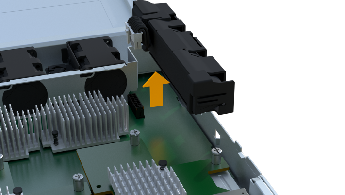
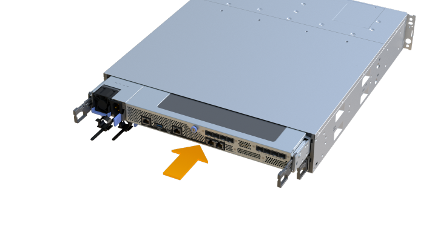

= 更換EF300或EF600電池
:allow-uri-read: 
:experimental: 
:icons: font
:imagesdir: ../media/

[role="lead"]
您可以更換EF300或EF600儲存系統中的電池。

.關於這項工作
每個控制器機箱都有一個電池、可在AC電源故障時保留快取的資料。如果「恢復大師」SANtricity 報告「電池故障」狀態或「需要更換電池」狀態、您必須更換受影響的電池。

.開始之前
* 確認所有使用這些磁碟區的主機上都未使用任何磁碟區、或安裝多重路徑驅動程式。
* 檢閱 link:batteries-overview-requirements-concept.html["EF300或EF600電池更換需求"]。
* 請確定您擁有下列項目：
+
** 替換電池。
** 一種或多種防靜電預防措施。
** 無靜電工作區。
** 用於識別連接至控制器容器的每條纜線的標籤。
** 管理站、具備瀏覽器、可存取SANtricity 控制器的《系統管理程式》。（若要開啟System Manager介面、請將瀏覽器指向控制器的網域名稱或IP位址。）

== 步驟1：使控制器離線

備份資料並將受影響的控制器置於離線狀態。

.步驟
. 從「還原系統管理程式」檢閱Recovery Guru中的詳細資料、確認電池有問題、並確保不需要先處理其他項目。SANtricity
. 從Recovery Guru的「Details（詳細資料）」區域中、判斷要更換的電池。
. 使用SANtricity NetApp System Manager備份儲存陣列的組態資料庫。
+
如果移除控制器時發生問題、您可以使用儲存的檔案來還原組態。系統會儲存RAID組態資料庫的目前狀態、其中包含控制器上磁碟區群組和磁碟集區的所有資料。

+
** 從系統管理員：
+
... 選取功能表：Support（支援）[Support Center（支援中心）> Diagnostics（診斷）]。
... 選擇*收集組態資料*。
... 按一下「* Collect*」。
+
檔案會以*組態Data-<arrayName>-<DateTimer>.7z*的名稱儲存在瀏覽器的「下載」資料夾中。

. 如果控制器尚未離線、請使用SANtricity 「系統管理程式」將其離線。
+
.. 選取*硬體*。
.. 如果圖形顯示磁碟機、請選取*顯示磁碟櫃背面*以顯示控制器。
.. 選取您要離線的控制器。
.. 從內容功能表中選取*離線*、然後確認您要執行此作業。
+

NOTE: 如果您使用SANtricity 嘗試離線的控制器來存取「無法使用」功能、SANtricity 就會顯示「無法使用」訊息。選擇*連線至替代網路連線*、即可使用SANtricity 其他控制器自動存取《系統管理程式》。

. 等候SANtricity 「更新」功能將控制器狀態更新為「離線」。
+

NOTE: 在更新狀態之前、請勿開始任何其他作業。

. 從Recovery Guru選取* Recheck*、然後確認「Details（詳細資料）」區域中的「OK to remove（確定要移除）」欄位顯示「Yes（是）」、表示移除此元件是安全的。

== 步驟2：移除控制器容器

以新的電池更換故障電池。

.步驟
. 放置於防靜電腕帶上或採取其他防靜電預防措施。
. 標示連接至控制器容器的每條纜線。
. 從控制器容器拔下所有纜線。
+

CAUTION: 為避免效能降低、請勿扭轉、摺疊、夾緊或踏上纜線。

. 確認控制器背面的快取作用中LED已關閉。
. 擠壓控制器兩側的握把、然後向後拉、直到它從機櫃中釋放為止。
+
image::../media/remove_controller_5.png[擠壓把手以移除控制器]

. 使用兩隻手和握把、將控制器外殼滑出機櫃。當控制器正面脫離機箱時、請用兩隻手將其完全拉出。
+

CAUTION: 請務必用兩隻手支撐控制器容器的重量。

+
image::../media/remove_controller_6.png[取下控制器時，請用雙手支撐控制器的重量]

. 將控制器容器放在無靜電的平面上。

== 步驟3：取出故障電池

將故障電池從控制器中取出。

.步驟
. 打開單一指旋螺絲並打開機蓋、以取下控制器機箱的機箱蓋。
. 確認控制器內部的綠色LED燈已關閉。
+
如果此綠色LED亮起、表示控制器仍在使用電池電力。您必須等到LED熄滅後、才能移除任何元件。

. 找到控制器側邊的「Press」（按下）索引標籤。
. 按下彈片並擠壓電池外殼、以解開電池。
+
image::../media/batt_3.png[" 按下彈片以解除電池鎖定]

. 輕壓裝有電池線路的連接器。將電池從主機板上拔下。
+
image::../media/batt_2.png[取下電池線路的連接器外殼]

. 將電池從控制器中取出、然後放在無靜電的平面上。
+

. 請依照您所在位置的適當程序來回收或棄置故障電池。
+

CAUTION: 為符合國際空運協會（IATA）規定、除非已安裝在控制器機櫃內、否則請勿以空運方式運送一顆電池。

== 步驟4：安裝新電池

從控制器容器中取出故障電池後、請依照此步驟安裝新電池。

.步驟
. 打開新電池的包裝、將其放在無靜電的平面上。
+

NOTE: 為符合IATA安全法規、更換電池的充電狀態（SoC）為30%以下。當您重新接上電源時、請記住、在更換電池充滿電且完成初始記憶週期之前、寫入快取不會恢復。

. 將電池裝入控制器、方法是將電池外殼與控制器側邊的金屬栓鎖對齊。
+
image::../media/batt_5.png[插入電池]

+
電池卡入定位。

. 將電池連接器插回主機板。

== 步驟5：重新安裝控制器容器

將控制器重新安裝到控制器機櫃中。

.步驟
. 放下控制器外殼上的護蓋、然後固定指旋螺絲。
. 在擠壓控制器的握把時、將控制器外殼全部滑入控制器機櫃。
+

NOTE: 正確安裝到機櫃時、控制器會發出喀聲。

+

== 步驟6：完成電池更換

將控制器置於線上、收集支援資料並恢復作業。

.步驟
. 將控制器置於線上。
+
.. 在System Manager中、瀏覽至「Hardware（硬體）」頁面。
.. 選擇*顯示控制器背面*。
.. 選取裝有更換電池的控制器。
.. 從下拉式清單中選取*線上放置*。

. 控制器開機時、請檢查控制器LED。
+
重新建立與其他控制器的通訊時：

+
** 黃色警示LED會持續亮起。
** 主機連結LED可能會亮起、閃爍或關閉、視主機介面而定。

. 當控制器重新連線時、請確認其狀態為最佳、並檢查控制器機櫃的注意LED。
+
如果狀態不是最佳、或是有任何警示LED亮起、請確認所有纜線都已正確安裝、且控制器機箱已正確安裝。如有必要、請移除並重新安裝控制器容器。

+

NOTE: 如果您無法解決問題、請聯絡技術支援部門。

. 按一下功能表：Support[升級中心]以確保SANtricity 安裝最新版本的作業系統。
+
視需要安裝最新版本。

. 確認所有磁碟區都已歸還給偏好的擁有者。
+
.. 選取功能表：Storage[磁碟區]。從「*所有磁碟區*」頁面、確認磁碟區已散佈至偏好的擁有者。選取功能表：More（更多）[變更擁有者]以檢視Volume擁有者。
.. 如果所有磁碟區均為慣用擁有者、請繼續執行步驟6。
.. 如果未傳回任何磁碟區、則必須手動傳回磁碟區。移至功能表：更多[重新分配磁碟區]。
.. 如果在自動發佈或手動發佈之後、只有部分磁碟區傳回給偏好的擁有者、您必須檢查Recovery Guru是否有主機連線問題。
.. 如果沒有Recovery Guru存在、或遵循Recovery Guru步驟、磁碟區仍不會歸還給偏好的擁有者、請聯絡支援部門。

. 使用SANtricity NetApp System Manager收集儲存陣列的支援資料。
+
.. 選取功能表：Support（支援）[Support Center（支援中心）> Diagnostics（診斷）]。
.. 選擇*收集支援資料*。
.. 按一下「* Collect*」。
+
檔案會以* support-data.7z*的名稱儲存在瀏覽器的「下載」資料夾中。

.接下來呢？
電池更換完成。您可以恢復正常作業。
