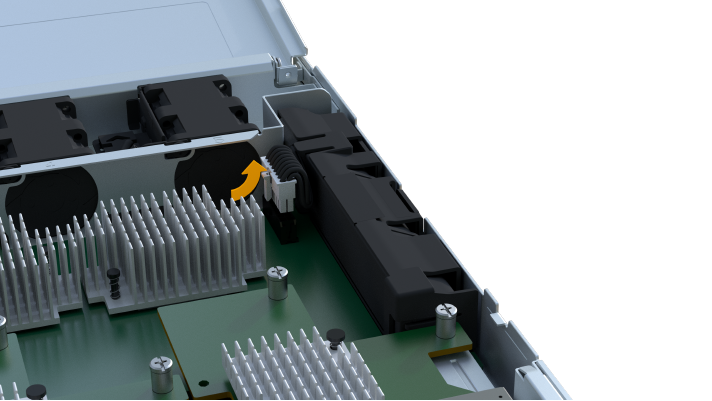

= 更換EF300或EF600控制器
:allow-uri-read: 
:experimental: 
:icons: font
:imagesdir: ../media/

[role="lead"]
您可以更換EF300或EF600控制器機櫃中的單一控制器。

.關於這項工作
當您更換故障的控制器容器時、必須將電池、電源供應器、DIMM、風扇和主機介面卡（HIC）從原始控制器容器中取出、然後將其安裝在更換的控制器容器中。

.開始之前
* 檢閱 link:controllers-overview-supertask-concept.html["EF300或EF600控制器更換需求"]。
* 判斷您是否有故障的控制器容器、方法有兩種：
+
** 《恢復大師SANtricity 》（Recovery Guru in the SytrSystem Manager）會引導您更換控制器容器。
** 控制器機箱上的黃色警示LED亮起、表示控制器發生故障。
+
[]
====

NOTE: 只要發生下列更換情況、控制器的琥珀色警示 LED 燈就會熄滅：

*** 替代電源供應器故障
*** 替代磁碟機路徑失敗
*** 藥屜開啟 / 遺失
*** 風扇故障 / 遺失
*** 電源供應器遺失

====

* 請確定您擁有下列項目：
+
** 更換控制器機箱的零件編號與您要更換的控制器機箱相同。
** 或您已採取其他防靜電預防措施。
** 無靜電工作區。
** 1號十字螺絲起子
** 用於識別連接至控制器容器的每條纜線的標籤。
** 管理站、具備瀏覽器、可存取SANtricity 控制器的《系統管理程式》。（若要開啟System Manager介面、請將瀏覽器指向控制器的網域名稱或IP位址。）

== 步驟1：準備更換控制器

準備更換故障的控制器容器、方法是驗證更換的控制器容器是否有正確的FRU零件編號、備份組態、以及收集支援資料。

.步驟
. 打開新控制器容器的包裝、將其放置在無靜電的平面上。
+
保存包裝材料、以便在運送故障控制器容器時使用。

. 找出控制器容器背面的MAC位址和FRU零件編號標籤。
. 從「系統管理程式」找到您要更換的控制器機箱的更換零件編號。SANtricity
+
當控制器發生故障且需要更換時、替換零件編號會顯示在Recovery Guru的「Details（詳細資料）」區域中。如果您需要手動尋找此號碼、請依照下列步驟操作：

+
.. 選取*硬體*。
.. 找到標有控制器圖示的控制器機櫃 image:../media/sam1130_ss_hardware_controller_icon_maint-ef600.gif[""]。
.. 按一下控制器圖示。
.. 選取控制器、然後按一下*「下一步*」。
.. 在「*基礎*」索引標籤上、記下控制器的*更換零件編號*。

. 確認故障控制器的更換零件編號與更換控制器的FRU零件編號相同。
+

CAUTION: *可能會遺失資料存取*-如果兩個部分的編號不同、請勿嘗試執行此程序。此外、如果故障的控制器容器包含主機介面卡（HIC）、您必須將該HIC安裝到新的控制器容器中。不相符的控制器或HIC會在您將新控制器上線時鎖定。

. 使用SANtricity NetApp System Manager備份儲存陣列的組態資料庫。
+
如果移除控制器時發生問題、您可以使用儲存的檔案來還原組態。系統會儲存RAID組態資料庫的目前狀態、其中包含控制器上磁碟區群組和磁碟集區的所有資料。

+
** 從系統管理員：
+
... 選取功能表：Support（支援）[Support Center（支援中心）> Diagnostics（診斷）]。
... 選擇*收集組態資料*。
... 按一下「* Collect*」。
+
檔案會以*組態Data-<arrayName>-<DateTimer>.7z*的名稱儲存在瀏覽器的「下載」資料夾中。

. 如果控制器尚未離線、請使用SANtricity 「系統管理程式」將其離線。
+
.. 選取*硬體*。
.. 如果圖形顯示磁碟機、請選取*顯示磁碟櫃背面*以顯示控制器。
.. 選取您要離線的控制器。
.. 從內容功能表中選取*離線*、然後確認您要執行此作業。

+

NOTE: 如果您使用SANtricity 嘗試離線的控制器來存取「無法使用」功能、SANtricity 就會顯示「無法使用」訊息。選擇*連線至替代網路連線*、即可使用SANtricity 其他控制器自動存取《系統管理程式》。

. 等候SANtricity 「更新」功能將控制器狀態更新為「離線」。
+

CAUTION: 在更新狀態之前、請勿開始任何其他作業。

. 從Recovery Guru中選取* Recheck*、然後確認「詳細資料」區域中的「*確定要移除*」欄位顯示*是*、表示移除此元件是安全的。

== 步驟2：移除故障的控制器

移除控制器容器、以新的容器取代故障的容器。

這是一個多步驟程序、需要您移除下列元件：電池、主機介面卡、電源供應器、DIMM和風扇。

=== 步驟2a：移除控制器容器

移除故障的控制器容器、以便更換新的控制器容器。

.步驟
. 放置於防靜電腕帶上或採取其他防靜電預防措施。
. 標示連接至控制器容器的每條纜線。
. 從控制器容器拔下所有纜線。
+

CAUTION: 為避免效能降低、請勿扭轉、摺疊、夾緊或踏上纜線。

. 如果控制器容器具有使用SFP+收發器的HIC、請移除SFP。
+
由於您必須從故障控制器容器中移除HIC、因此您必須從HIC連接埠移除任何SFP。重新連接纜線時、您可以將這些SFP移至新的控制器容器。

. 擠壓控制器兩側的握把、然後向後拉、直到它從機櫃中釋放為止。
+
image::../media/remove_controller_5.png[擠壓把手以移除控制器]

. 使用兩隻手和握把、將控制器外殼滑出機櫃。當控制器正面脫離機箱時、請用兩隻手將其完全拉出。
+

CAUTION: 請務必用兩隻手支撐控制器容器的重量。

+
image::../media/remove_controller_6.png[取下控制器時，請用雙手支撐控制器的重量]

. 將控制器容器放在無靜電的平面上。

=== 步驟2b：取出電池

從故障控制器容器中取出電池、以便將其安裝在新的控制器容器中。

.步驟
. 打開單一指旋螺絲並打開機蓋、以取下控制器機箱的機箱蓋。
. 找到控制器側邊的「Press」（按下）索引標籤。
. 按下彈片並擠壓電池外殼、以解開電池。
+
image::../media/batt_3.png[" 按下彈片以解除電池鎖定]

. 輕壓裝有電池線路的連接器。向上拉動電池，將電池從主機板上拔下。
. 將電池從控制器中取出，然後放在平坦，無靜電的表面上。image:../media/batt_4.png["將電池從控制器中取出"]

=== 步驟2c：移除HIC

如果控制器容器包含HIC、您必須從原始控制器容器中移除HIC。否則、您可以跳過此步驟。

.步驟
. 使用十字螺絲起子、卸下將HIC面板連接至控制器容器的兩顆螺絲。
+
image::../media/hic_2.png[取下 HIC 面板]

+

NOTE: 上圖為HIC外觀可能有所不同的範例。

. 卸下HIC面板。
. 使用手指或十字螺絲起子、旋鬆將HIC固定至控制器卡的單一指旋螺絲。
+
image::../media/hic_3.png[鬆開 HIC 指旋螺絲]

+

NOTE: HIC的頂端有三個螺絲位置、但只有一個。

. 向上提起HIC卡並將其從控制器中取出、以小心地將其從控制器卡上拆下。
+

CAUTION: 請注意、請勿刮傷或撞擊HIC底部或控制器卡頂端的元件。

+
image::../media/hic_4.png[從控制器卡上卸下 HIC]

. 將HIC放置在無靜電的平面上。

=== 步驟2D：移除電源供應器

移除電源供應器、以便將其安裝在新的控制器中。

.步驟
. 拔下電源線：
+
.. 打開電源線固定器、然後從電源供應器拔下電源線。
.. 從電源拔下電源線。

. 找到電源供應器右側的彈片、然後朝電源供應器單元方向按下。
+
image::../media/psup_2.png[按下電源供應器旁的標籤]

. 找到電源供應器正面的握把。
. 使用握把將電源供應器直接滑出系統。
+

+

CAUTION: 移除電源供應器時、請務必用兩隻手支撐其重量。

=== 步驟2e：移除DIMM

移除DIMM、以便將其安裝在新的控制器中。

.步驟
. 找到控制器上的DIMM。
. 請注意插槽中的DIMM方向、以便您以適當的方向插入替換的DIMM。
+

NOTE: DIMM底部有一個缺口、可協助您在安裝期間對齊DIMM。

. 緩慢地將DIMM兩側的兩個DIMM彈出彈片分開、將DIMM從插槽中退出、然後將其從插槽中滑出。
+

NOTE: 小心拿住DIMM的邊緣、避免對DIMM電路板上的元件施加壓力。

+
image::../media/dimm_2.png[按下 DIMM 插槽上的彈出卡舌]

+
image::../media/dimim_3.png[移除 DIMM]

=== 步驟2f：移除風扇

移除風扇、以便將其安裝在新的控制器中。

.步驟
. 從控制器中輕拉風扇。
+
image::../media/fan_2.png[卸下風扇]

. 重複上述步驟、直到所有風扇都移除為止。

== 步驟3：安裝新的控制器

安裝新的控制器容器以更換故障的控制器容器。

這是一個多步驟程序、需要您從原始控制器安裝下列元件：電池、主機介面卡、電源供應器、DIMM和風扇。

=== 步驟3a：安裝電池

將電池裝入更換的控制器容器中。

.步驟
. 請確定您擁有：
+
** 原始控制器容器中的電池、或您訂購的新電池。
** 更換控制器容器。

. 將電池裝入控制器、方法是將電池外殼與控制器側邊的金屬栓鎖對齊。
+
image::../media/batt_5.png[安裝電池]

+
電池卡入定位。

. 將電池連接器插回主機板。

=== 步驟3b：安裝HIC

如果您從原始控制器容器中移除HIC、則必須將該HIC安裝在新的控制器容器中。否則、您可以跳過此步驟。

.步驟
. 使用1號十字螺絲起子、卸下將空白面板連接至更換控制器外殼的兩顆螺絲、然後卸下面板。
. 將HIC上的單一指旋螺絲與控制器上的對應孔對齊、並將HIC底部的連接器與控制器卡上的HIC介面連接器對齊。
+
請注意、請勿刮傷或撞擊HIC底部或控制器卡頂端的元件。

+
image::../media/hic_7.png[安裝HIC]

+

NOTE: 上圖為範例、您的HIC外觀可能有所不同。

. 小心地將HIC降低到位、然後輕按HIC接頭以固定。
+

CAUTION: *可能的設備損壞*：請非常小心、不要夾住HIC和指旋螺絲之間控制器LED的金帶狀連接器。

. 以手鎖緊HIC指旋螺絲。
+
請勿使用螺絲起子、否則螺絲可能會過緊。

+
image::../media/hic_3.png[用手將 HIC 指旋螺絲鎖緊至控制器]

+

NOTE: 上圖為範例、您的HIC外觀可能有所不同。

. 使用1號十字螺絲起子、使用兩顆螺絲將您從原始控制器容器中取出的HIC面板安裝到新的控制器容器。

=== 步驟3c：安裝電源供應器

將電源供應器安裝到更換的控制器容器中。

.步驟
. 用兩隻手支撐電源供應器邊緣、並將其與系統機箱的開孔對齊、然後使用CAM握把將電源供應器輕推入機箱。
+
電源供應器採用鎖定式設計、只能以單一方式安裝。

+

CAUTION: 將電源供應器滑入系統時、請勿過度施力、否則可能會損壞連接器。

+
image::../media/psup_4.png[將電源供應器安裝至控制器]

=== 步驟3D：安裝DIMM

將DIMM安裝到新的控制器容器中。

.步驟
. 拿住DIMM的邊角、將其對齊插槽。
+
DIMM插針之間的槽口應與插槽中的卡舌對齊。

. 將DIMM正面插入插槽。
+
image::../media/dimm_4.png[將 DIMM 安裝到控制器的插槽中]

+
DIMM可緊密插入插槽、但應該很容易就能裝入。如果沒有、請重新將DIMM與插槽對齊、然後重新插入。

+

NOTE: 目視檢查DIMM、確認其對齊並完全插入插槽。

. 在DIMM頂端邊緣小心地推入、但穩固地推入、直到鎖條卡入DIMM兩端的槽口。
+

NOTE: DIMM可緊密安裝。您可能需要一次輕按一側、並分別固定每個彈片。

+
image::../media/dimm_5.png[將 DIMM 插槽上的閂鎖往上壓以固定]

=== 步驟3e：安裝風扇

將風扇安裝到更換的控制器容器中。

.步驟
. 將風扇完全滑入更換的控制器。
+
image::../media/fan_3.png[將風扇安裝到控制器中]

+
image::../media/fan_3_a.png[將風扇安裝到控制器中]

. 重複上述步驟、直到安裝完所有風扇為止。

=== 步驟3f：安裝新的控制器容器

最後、將新的控制器外殼安裝到控制器機櫃中。

.步驟
. 放下控制器外殼上的護蓋、然後固定指旋螺絲。
. 在擠壓控制器的握把時、將控制器外殼全部滑入控制器機櫃。
+

NOTE: 正確安裝到機櫃時、控制器會發出喀聲。

+
image::../media/remove_controller_7.png[將控制器安裝到機櫃中]

. 將原始控制器的SFP安裝在新控制器的主機連接埠中（如果它們安裝在原始控制器中）、然後重新連接所有纜線。
+
如果您使用多個主機傳輸協定、請務必在正確的主機連接埠中安裝SFP。

. 如果原始控制器使用DHCP作為IP位址、請在替換控制器背面的標籤上找到MAC位址。請網路管理員將您移除的控制器的DNS/網路和IP位址與更換控制器的MAC位址建立關聯。
+

NOTE: 如果原始控制器未將DHCP用於IP位址、則新的控制器會採用您移除的控制器IP位址。

== 步驟4：完成控制器更換

將控制器置於線上、收集支援資料並恢復作業。

.步驟
. 將控制器置於線上。
+
.. 在System Manager中、瀏覽至「Hardware（硬體）」頁面。
.. 選擇*顯示控制器背面*。
.. 選取更換的控制器。
.. 從下拉式清單中選取*線上放置*。

. 控制器開機時、請檢查控制器LED。
+
重新建立與其他控制器的通訊時：

+
** 黃色警示LED會持續亮起。
** 主機連結LED可能會亮起、閃爍或關閉、視主機介面而定。

. 當控制器重新連線時、請檢查 Recovery Guru 中是否報告了 NVSRAM 不相符。
+
.. 如果報告了 NVSRAM 不匹配問題、請使用下列 SMCLI 命令升級 NVSRAM ：
+
[listing]
----
SMcli <controller A IP> <controller B IP> -u admin -p <password> -k -c "download storageArray NVSRAM file=\"C:\Users\testuser\Downloads\NVSRAM .dlp file>\" forceDownload=TRUE;"
----
+
。 `-k` 如果陣列不安全、則需要參數。

+

NOTE: 如果無法完成 SMCLI 命令、請聯絡 https://www.netapp.com/company/contact-us/support/["NetApp 技術支援"^] 或登入 https://mysupport.netapp.com["NetApp 支援網站"^] 以建立案例。

. 確認系統狀態為最佳狀態、並檢查控制器機櫃的注意 LED 。
+
如果狀態不是最佳、或是有任何警示LED亮起、請確認所有纜線都已正確安裝、且控制器機箱已正確安裝。如有必要、請移除並重新安裝控制器容器。

+

NOTE: 如果您無法解決問題、請聯絡技術支援部門。

. 按一下功能表： Hardware （硬體） [ Support （支援） > Upgrade Center （升級中心） ] 、確保系統上的韌體和 NVSRAM 版本達到所需的層級。
+
視需要安裝最新版本。

. 確認所有磁碟區都已歸還給偏好的擁有者。
+
.. 選取功能表：Storage[磁碟區]。從「*所有磁碟區*」頁面、確認磁碟區已散佈至偏好的擁有者。選取功能表：More（更多）[變更擁有者]以檢視Volume擁有者。
.. 如果所有磁碟區均為慣用擁有者、請繼續執行步驟6。
.. 如果未傳回任何磁碟區、則必須手動傳回磁碟區。移至功能表：更多[重新分配磁碟區]。
.. 如果在自動發佈或手動發佈之後、只有部分磁碟區傳回給偏好的擁有者、您必須檢查Recovery Guru是否有主機連線問題。
.. 如果沒有Recovery Guru存在、或遵循Recovery Guru步驟、磁碟區仍不會歸還給偏好的擁有者、請聯絡支援部門。

. 使用SANtricity NetApp System Manager收集儲存陣列的支援資料。
+
.. 選取功能表：Support（支援）[Support Center（支援中心）> Diagnostics（診斷）]。
.. 選擇*收集支援資料*。
.. 按一下「* Collect*」。
+
檔案會以* support-data.7z*的名稱儲存在瀏覽器的「下載」資料夾中。

.接下來呢？
您的控制器更換已完成。您可以恢復正常作業。
