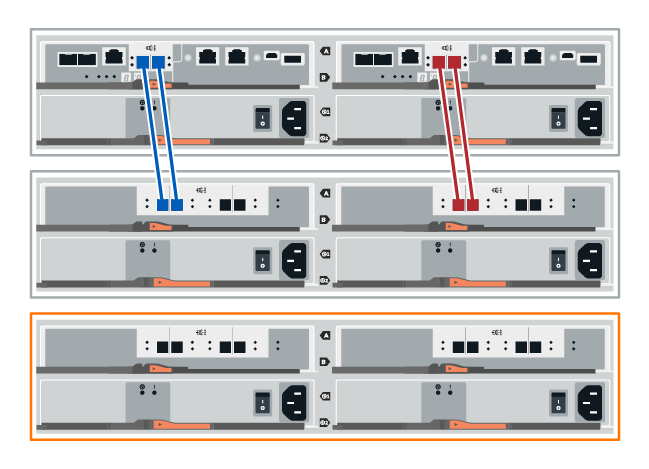
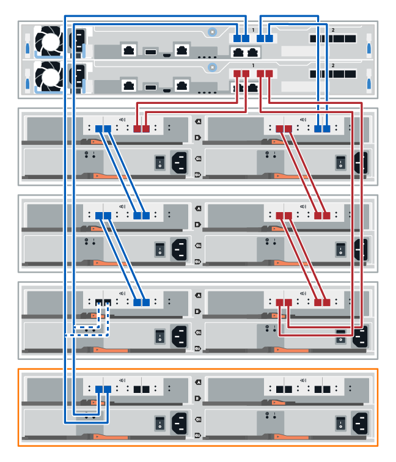

= 熱新增磁碟機櫃
:allow-uri-read: 
:icons: font
:imagesdir: ../media/

[role="lead"]
您可以新增磁碟機櫃、同時仍將電力應用至儲存系統的其他元件。您可以設定、重新設定、新增或重新配置儲存系統容量、而不中斷使用者對資料的存取。

.開始之前
由於此程序的複雜度、建議採取下列步驟：

* 請先閱讀所有步驟、再開始執行程序。
* 確保熱新增磁碟機櫃是您所需的程序。

.關於這項工作
本程序適用於將 DE212C ， DE224C 或 DE460C 磁碟機櫃熱新增至 E2800 ， E2800B ， EF280 ， E5700 ， E5700B ， EF570 ， EF300 ， EF600 或 E4000 控制器機櫃。

此程序適用於IOM12和IOM12B磁碟機櫃。

NOTE: IOM12B模組僅在SANtricity 不含作業系統11.70.2的版本上受支援。在安裝或升級至IOM12B之前、請先確認您的控制器韌體已更新。

NOTE: 此程序適用於類似的機櫃IOM熱交換或更換。這表示您只能將IOM12模組更換為另一個IOM12模組、或將IOM12B模組更換為另一個IOM12B模組。（您的機櫃可以有兩個IOM12模組、或有兩個IOM12B模組。）

如果您要將較舊的控制器機櫃佈線至DE212C、DE224C或DE460、請參閱 https://mysupport.netapp.com/ecm/ecm_download_file/ECMLP2859057["將IOM磁碟機櫃新增至現有的E27XX、E56XX或EF560控制器機櫃"^]。

NOTE: 若要維護系統完整性、您必須依照所顯示的順序執行程序。

== 步驟1：準備新增磁碟機櫃

若要準備熱新增磁碟機櫃、您必須檢查重要事件並檢查IOM的狀態。

.開始之前
* 儲存系統的電源必須能夠滿足新磁碟機櫃的電源需求。如需磁碟機櫃的電源規格、請參閱 https://hwu.netapp.com/Controller/Index?platformTypeId=2357027["Hardware Universe"^]。
* 現有儲存系統的佈線模式必須符合本程序所示的其中一個適用配置。

.步驟
. 在「系統管理程式」中、選取*支援*>*支援中心*>*診斷*。SANtricity
. 選擇*收集支援資料*。
+
此時會出現「收集支援資料」對話方塊。

. 按一下「* Collect*」。
+
檔案會以support-data.7z的名稱儲存在瀏覽器的Downloads資料夾中。資料不會自動傳送至技術支援部門。

. 選擇* Support *>* Event Log*。
+
「事件記錄」頁面會顯示事件資料。

. 選取*優先順序*欄的標題、將關鍵事件排序至清單頂端。
. 檢閱過去兩到三週內發生的事件的系統重大事件、並確認最近發生的任何重大事件均已解決或解決。
+

NOTE: 如果在前兩到三週內發生未解決的重大事件、請停止此程序、並聯絡技術支援部門。只有在問題解決時、才繼續執行此程序。

. 如果您的硬體已連接 IOM ，請完成下列步驟。否則，請前往<<step2_install_drive_shelf,步驟 2 ：安裝磁碟機櫃並加電。>>
+
.. 選取*硬體*。
.. 選取* IOM（ESM*）*圖示。
+
image::../media/sam1130_ss_hardware_iom_icon.gif[IOM （ ESMS ）圖示]

+
「Shelf元件設定」對話方塊隨即出現、並選取「* IOM（ESM*）*」索引標籤。

.. 確保每個IOM /ESm顯示的狀態是_optal__。
.. 按一下*顯示更多設定*。
.. 確認存在下列情況：
+
*** 偵測到的ESM/IOM數量、與系統中安裝的ESM/IOM數量、以及每個磁碟機櫃的相同。
*** 這兩個ESM/IOM都顯示通訊正常。
*** DE212C、DE224C和DE460C磁碟機櫃的資料傳輸率為12Gb/s、其他磁碟機匣的資料傳輸率為6 Gb/s。

== 步驟2：安裝磁碟機櫃並接上電源

您可以安裝新的磁碟機櫃或先前安裝的磁碟機櫃、開啟電源、並檢查是否有任何需要注意的LED。

.步驟
. 如果您要安裝先前安裝在儲存系統中的磁碟機櫃、請移除磁碟機。此程序稍後必須一次安裝一個磁碟機。
+
如果您安裝的磁碟機櫃安裝記錄不明、您應該假設它先前已安裝在儲存系統中。

. 在裝有儲存系統元件的機架中安裝磁碟機櫃。
+

NOTE: 如需實體安裝與電源線的完整程序、請參閱機型的安裝說明。您的機型安裝說明包含安全安裝磁碟機櫃時必須考量的注意事項與警告。

. 開啟新磁碟機櫃的電源、並確認磁碟機櫃上沒有亮起黃色的警示LED。如有可能、請先解決任何故障狀況、再繼續執行此程序。

== 步驟3：連接系統纜線

如果您要將較舊的控制器機櫃佈線至DE212C、DE224C或DE460、請參閱 https://mysupport.netapp.com/ecm/ecm_download_file/ECMLP2859057["將IOM磁碟機櫃新增至現有的E27XX、E56XX或EF560控制器機櫃"^]。

[role="tabbed-block"]
====
.連接 E2800 或 E5700 的磁碟機櫃
--
您將磁碟機櫃連接至控制器A、確認IOM狀態、然後將磁碟機櫃連接至控制器B

.步驟
. 將磁碟機櫃連接至控制器A
+
下圖顯示其他磁碟機櫃與控制器A之間的連線範例若要在您的機型上找到連接埠、請參閱 https://hwu.netapp.com/Controller/Index?platformTypeId=2357027["Hardware Universe"^]。

+

+
image::../media/hot_e5700_1.png[將磁碟機櫃連接至控制器]

. 在「系統管理程式」中、按一下「*硬體*」SANtricity 。
+

NOTE: 在此程序中、您只有一個作用中路徑可通往控制器機櫃。

. 視需要向下捲動以查看新儲存系統中的所有磁碟機櫃。如果未顯示新磁碟機櫃、請解決連線問題。
. 選取新磁碟機櫃的* ESM/IOM*圖示。
+
image::../media/sam1130_ss_hardware_iom_icon.gif[ESM/IOM 圖示]

+
「*機櫃元件設定*」對話方塊隨即出現。

. 在「*機架元件設定*」對話方塊中選取「* ESM/IOM*」索引標籤。
. 選擇*顯示更多選項*、然後確認下列事項：
+
** 列出了IOM / esm A。
** SAS-3磁碟機櫃的目前資料傳輸率為12 Gbps。
** 卡片通訊正常。

. 從控制器B拔下所有擴充纜線
. 將磁碟機櫃連接至控制器B
+
下圖顯示其他磁碟機櫃與控制器B之間的連線範例若要在您的機型上找到連接埠、請參閱 https://hwu.netapp.com/Controller/Index?platformTypeId=2357027["Hardware Universe"^]。

+
image::../media/hot_e5700_2.png[磁碟機櫃連線範例]

. 如果尚未選取、請選取「*機架元件設定*」對話方塊中的「* ESM/IOM*」索引標籤、然後選取「*顯示更多選項*」。驗證卡通訊是否為*是*。
+

NOTE: Optimal（最佳）狀態表示新磁碟機櫃相關的備援遺失錯誤已解決、且儲存系統已穩定。

--
.連接 EF300 或 EF600 的磁碟機櫃
--
您將磁碟機櫃連接至控制器A、確認IOM狀態、然後將磁碟機櫃連接至控制器B

.開始之前
* 您已將韌體更新為最新版本。若要更新韌體、請遵循中的指示 link:../upgrade-santricity/index.html["升級SANtricity 作業系統"]。

.步驟
. 從IOM12連接埠1和2拔下堆疊中前一個機櫃的兩條A側控制器纜線、然後將它們連接至新的IOM12連接埠1和2。
+
image::../media/de224c_sides.png[從控制器 A 拔下纜線，並連接至新機櫃]

. 將纜線連接至A側IOM12連接埠、從新機櫃連接至上一個機櫃IOM12連接埠1和2。
+
下圖顯示額外磁碟機櫃與上一個最後一個磁碟櫃之間的側邊連線範例。若要在您的機型上找到連接埠、請參閱 https://hwu.netapp.com/Controller/Index?platformTypeId=2357027["Hardware Universe"^]。

+

+
image::../media/hot_ef_1.png[磁碟機櫃纜線範例]

. 在「系統管理程式」中、按一下「*硬體*」SANtricity 。
+

NOTE: 在此程序中、您只有一個作用中路徑可通往控制器機櫃。

. 視需要向下捲動以查看新儲存系統中的所有磁碟機櫃。如果未顯示新磁碟機櫃、請解決連線問題。
. 選取新磁碟機櫃的* ESM/IOM*圖示。
+
image::../media/sam1130_ss_hardware_iom_icon.gif[ESM/IOM 圖示]

+
「*機櫃元件設定*」對話方塊隨即出現。

. 在「*機架元件設定*」對話方塊中選取「* ESM/IOM*」索引標籤。
. 選擇*顯示更多選項*、然後確認下列事項：
+
** 列出了IOM / esm A。
** SAS-3磁碟機櫃的目前資料傳輸率為12 Gbps。
** 卡片通訊正常。

. 從IOM12連接埠1和2拔下B側控制器纜線、從堆疊中的上一個最後一個機櫃拔下、然後將它們連接至新的機櫃IOM12連接埠1和2。
. 將纜線連接至B側IOM12連接埠、從新機櫃連接至上一個機櫃IOM12連接埠1和2。
+
下圖顯示額外磁碟機櫃與上一個最後一個磁碟櫃之間的B側連線範例。若要在您的機型上找到連接埠、請參閱 https://hwu.netapp.com/Controller/Index?platformTypeId=2357027["Hardware Universe"^]。

+
image::../media/hot_ef_2.png[磁碟機櫃纜線範例]

. 如果尚未選取、請選取「*機架元件設定*」對話方塊中的「* ESM/IOM*」索引標籤、然後選取「*顯示更多選項*」。驗證卡通訊是否為*是*。
+

NOTE: Optimal（最佳）狀態表示新磁碟機櫃相關的備援遺失錯誤已解決、且儲存系統已穩定。

--
.連接 E4000 的磁碟機櫃
--
您將磁碟機櫃連接至控制器A、確認IOM狀態、然後將磁碟機櫃連接至控制器B

.步驟
. 將磁碟機櫃連接至控制器A
+
image::../media/hot_e4000_cabling_1.png[磁碟機櫃纜線]

. 在「系統管理程式」中、按一下「*硬體*」SANtricity 。
+

NOTE: 在此程序中、您只有一個作用中路徑可通往控制器機櫃。

. 視需要向下捲動以查看新儲存系統中的所有磁碟機櫃。如果未顯示新磁碟機櫃、請解決連線問題。
. 選取新磁碟機櫃的* ESM/IOM*圖示。
+
image::../media/sam1130_ss_hardware_iom_icon.gif[IOM 硬體圖示]

+
「*機櫃元件設定*」對話方塊隨即出現。

. 在「*機架元件設定*」對話方塊中選取「* ESM/IOM*」索引標籤。
. 選擇*顯示更多選項*、然後確認下列事項：
+
** 列出了IOM / esm A。
** SAS-3磁碟機櫃的目前資料傳輸率為12 Gbps。
** 卡片通訊正常。

. 從控制器B拔下所有擴充纜線
. 將磁碟機櫃連接至控制器B
+
image::../media/hot_e4000_cabling_2.png[磁碟機櫃纜線]

. 如果尚未選取、請選取「*機架元件設定*」對話方塊中的「* ESM/IOM*」索引標籤、然後選取「*顯示更多選項*」。驗證卡通訊是否為*是*。
+

NOTE: Optimal（最佳）狀態表示新磁碟機櫃相關的備援遺失錯誤已解決、且儲存系統已穩定。

--
====

== 步驟4：完成熱新增

您可以檢查是否有任何錯誤、並確認新新增的磁碟機櫃使用最新的韌體來完成熱新增功能。

.步驟
. 在「系統管理程式」中、按一下「*首頁*」SANtricity 。
. 如果頁面頂端的中央顯示標有*從問題中恢復*的連結、請按一下連結、並解決Recovery Guru中指出的任何問題。
. 在「支援系統管理程式」中、按一下「*硬體*」、然後視需要向下捲動以查看新增的磁碟機櫃。SANtricity
. 對於先前安裝在不同儲存系統中的磁碟機、請在新安裝的磁碟機櫃中一次新增一個磁碟機。在插入下一個磁碟機之前、請等待每個磁碟機都能被辨識。
+
當儲存系統辨識磁碟機時、「*硬體*」頁面中的磁碟機插槽呈現為藍色矩形。

. 選取*支援*>*支援中心*>*支援資源*索引標籤。
. 按一下「*軟體與韌體詳細目錄*」連結、檢查新磁碟機櫃上安裝的IOM / esm韌體版本和磁碟機韌體版本。
+

NOTE: 您可能需要向下捲動頁面、才能找到此連結。

. 如有必要、請升級磁碟機韌體。
+
除非您已停用升級功能、否則IOM / ESm韌體會自動升級至最新版本。

熱新增程序已完成。您可以恢復正常作業。
