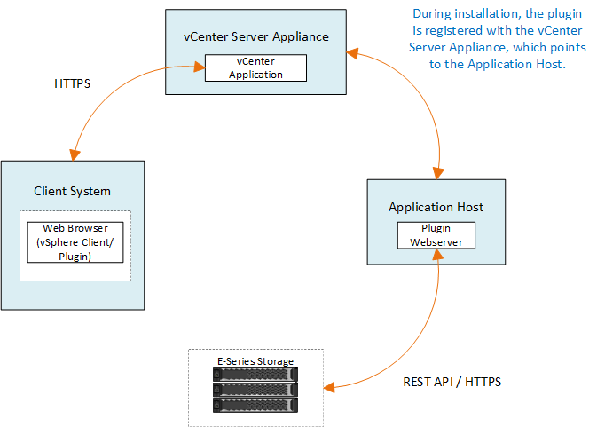

= vCenter儲存外掛程式總覽
:hardbreaks:
:allow-uri-read: 
:nofooter: 
:icons: font
:linkattrs: 
:imagesdir: ../media/

[role="lead"]
適用於vCenter的《VMware vSphere儲存外掛程式》SANtricity 可從VMware vSphere Client工作階段中、提供E系列儲存陣列的整合式管理功能。

== 可用的工作

您可以使用外掛程式來執行下列工作：

* 檢視及管理網路中探索到的儲存陣列。
* 在多個儲存陣列的群組上執行批次作業。
* 在軟體作業系統上執行升級。
* 將設定從一個儲存陣列匯入另一個儲存陣列。
* 設定磁碟區、SSD快取、主機、主機叢集、集區、 和Volume群組。
* 啟動System Manager介面、以在陣列上執行其他管理工作。

NOTE: 外掛程式並非直接取代系統管理員介面、而系統管理員介面內嵌在儲存陣列的每個控制器上。System Manager提供額外的管理功能；如有需要、您可以在外掛程式的主檢視畫面中選取儲存陣列、然後按一下* Launch *來開啟System Manager。

此外掛程式需要部署在VMware環境中的VMware vCenter Server Appliance、以及安裝及執行外掛程式Web伺服器的應用程式主機。

如需vCenter環境中通訊的詳細資訊、請參閱下圖。

== 介面總覽

當您登入外掛程式時、主頁會開啟*管理-全部*。在此頁面中、您可以檢視及管理網路中所有探索到的儲存陣列。

=== 導覽側邊列

導覽側邊列會顯示下列項目：

* *管理*：探索網路中的儲存陣列、啟動陣列的System Manager、將設定從一個陣列匯入多個陣列、管理陣列群組、升級SANtricity 作業系統、以及配置儲存設備。
* *憑證管理*-管理在瀏覽器與用戶端之間驗證的憑證。
* *作業*：檢視批次作業的進度、例如將設定從一個陣列匯入另一個陣列。

NOTE: 當儲存陣列處於非最佳狀態時、部分作業無法使用。

* *支援*-檢視技術支援選項、資源和聯絡人。

=== 支援的瀏覽器

vCenter的儲存外掛程式可從多種瀏覽器存取。支援下列瀏覽器和版本。

* Google Chrome 89或更新版本
* Mozilla Firefox 80或更新版本
* Microsoft Edge 90或更新版本

=== 使用者角色與權限

若要存取vCenter儲存外掛程式中的工作、使用者必須擁有讀寫權限。根據預設、所有已定義的VMware vCenter使用者ID都沒有權限可在外掛程式中執行工作。

== 組態總覽

組態包括下列步驟：

. link:san-spvc-ic-installation.html["安裝並註冊外掛程式"]。
. link:san-spvc-ic-user-access.html["設定外掛程式存取權限"]。
. link:san-spvc-ic-login-and-navigation.html["登入外掛程式介面"]。
. link:san-spvc-ic-storage-array-discovery.html["探索儲存陣列"]。
. link:san-spvc-ic-storage-provisioning.html["配置儲存設備"]。

== 如需詳細資訊、請參閱

如需管理vSphere Client中資料存放區的詳細資訊、請參閱 https://docs.vmware.com/en/VMware-vSphere/index.html["VMware vSphere文件"^]。
